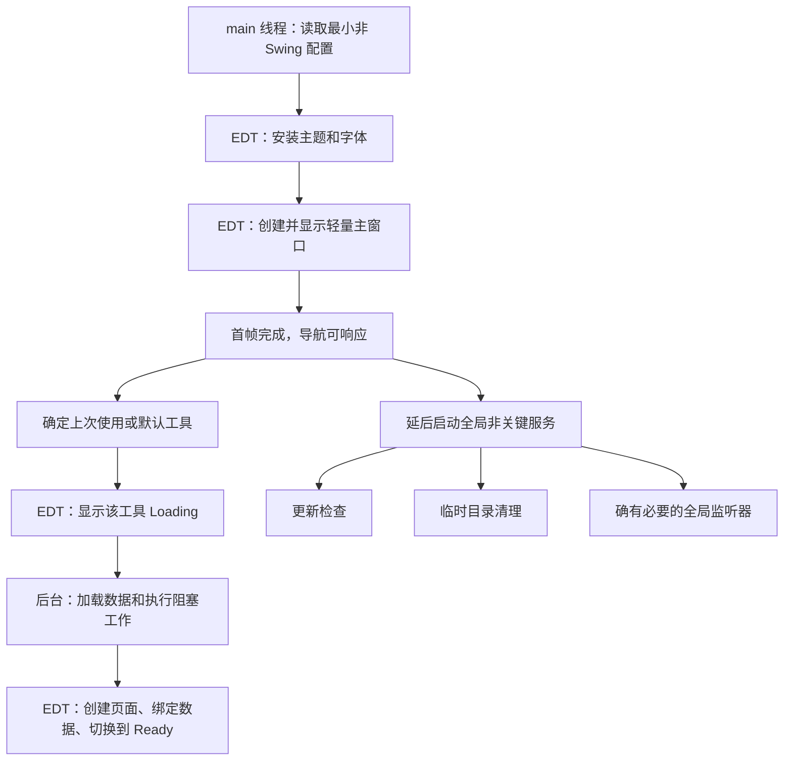

# MooTool Java 启动响应性优化方案

> 状态：首批实施中（阶段 0–2 + Quick Note / Net P0）
>
> 更新日期：2026-07-24
>
> 适用范围：MooTool Java / Swing 客户端
>
> 主要目标：窗口出现后保持可交互，消除启动期间“界面已显示但像卡死”的体验

## 1. 背景

MooTool Java 在启动时会创建主窗口、挂载全部功能页，并同时启动大量页面初始化任务。部分任务通过 `SwingUtilities.invokeLater` 更新界面，部分任务则直接从 `main` 线程或后台线程读写 Swing 组件。

这会同时引发以下问题：

1. 大量初始化任务集中向 AWT Event Dispatch Thread（下文简称 EDT）提交更新，形成事件队列洪峰。
2. EDT 忙于创建组件、安装监听器、布局和重绘，鼠标、键盘、窗口拖动等输入事件只能排队等待。
3. 后台线程与 EDT 并发访问 Swing 组件，可能竞争组件树锁，并产生不可预测的布局、绘制和状态问题。
4. Loading 页面很快被主页面替换，但主页面仍在初始化，用户无法判断应用是否已经可用。
5. 当前启动流程一次性初始化所有工具，即使用户本次不会访问其中大部分页面。

`SwingUtilities.invokeLater` 本身不是卡顿根因。它只是把任务加入 EDT 队列；真正需要治理的是：

- 单个 EDT 任务是否过重；
- 启动期间提交了多少重复 UI 更新；
- 是否在 EDT 执行了文件、数据库、网络、Git、系统命令等阻塞操作；
- 是否从非 EDT 线程操作 Swing；
- 是否可以把非当前页面延迟到首次访问时初始化。

## 2. 当前实现与问题定位

### 2.1 启动线程边界不正确

`App.main()` 中只有字体安装显式调用了 `invokeLater`，窗口创建和后续大部分 Swing 操作实际在 `main` 线程执行：

- `src/main/java/com/luoboduner/moo/tool/App.java:97`：字体安装单独排入 EDT。
- `src/main/java/com/luoboduner/moo/tool/App.java:99`：主题初始化在 `main` 线程执行。
- `src/main/java/com/luoboduner/moo/tool/App.java:105-110`：创建、初始化并显示 `MainFrame`。
- `src/main/java/com/luoboduner/moo/tool/App.java:120-139`：字体、内容面板、页面初始化和首次启动引导。

结果是 EDT 已经开始绘制和处理事件时，`main` 线程仍在修改同一套 Swing 组件。

此外，`App.sqlSession` 在类静态初始化阶段创建：

```java
public static SqlSession sqlSession = MybatisUtil.getSqlSession();
```

这会影响窗口首次出现时间。它不一定是窗口显示后不可点击的直接原因，但应纳入启动耗时治理。

### 2.2 所有功能页被提前创建

`MainWindow.init()` 在启动时调用每个 `Form.getInstance()`，创建并挂载全部工具页面：

```text
src/main/java/com/luoboduner/moo/tool/ui/form/MainWindow.java:120-144
```

该过程会集中产生：

- IntelliJ GUI Designer 组件树构造；
- 图标、字体和编辑器组件初始化；
- `JTabbedPane`、分割面板和滚动面板布局；
- `revalidate`、`updateUI` 和重绘；
- 部分 Form 静态字段初始化及数据库 Mapper 获取。

仅仅把后续 `Form.init()` 改为异步，无法消除这里的首屏构造成本。

### 2.3 23 个页面初始化任务并发启动

`Init.initAllTab()` 通过 `ThreadUtil.execute` 同时提交 23 个 `Form::init`：

```text
src/main/java/com/luoboduner/moo/tool/ui/Init.java:232-255
```

这些 `init()` 并非纯后台任务。例如：

- `QuickNoteForm.init()` 初始化 UI、字体、列表、监听器、文件监视和 Git 调度器；
- `JsonBeautyForm.init()` 初始化 UI、列表、字体、监听器和 Vault 服务；
- `HostForm.init()` 初始化系统托盘、UI、列表和监听器；
- `AboutForm.init()` 修改标签、滚动面板、图片和推荐组件。

上述方法包含大量 Swing 操作，却从后台线程执行，违反 Swing 单线程规则。并发初始化还会让数据库、磁盘、Git、图片解码和 EDT 更新在应用刚打开时同时争抢资源。

### 2.4 页面切换监听器存在 EDT 阻塞

`TabListener.stateChanged()` 运行在 EDT，但在进入网络工具时直接执行：

```java
RuntimeUtil.execForStr("ipconfig");
RuntimeUtil.execForStr("ifconfig");
```

位置：

```text
src/main/java/com/luoboduner/moo/tool/ui/listener/TabListener.java:46-57
```

系统命令执行期间，整个界面无法处理输入。这类代码即使与首次启动无关，也会造成相同的“点击后卡住”体验，需要采用同一套线程边界进行治理。

### 2.5 Loading 状态与真实就绪状态不一致

当前流程先显示 `LoadingForm`，随后立即调用：

```java
mainFrame.setContentPane(MainWindow.getInstance().getMainPanel());
```

之后才执行 `MainWindow.init()` 和 `Init.initAllTab()`。因此用户看到主界面时，后台仍在大量修改页面。`mainFrame.remove(loadingPanel)` 发生在内容面板已经被替换之后，也不能表达真实的加载阶段。

## 3. 优化目标

### 3.1 用户体验目标

1. 主窗口一旦显示，菜单、导航、窗口拖动和已就绪页面应持续响应。
2. 未就绪页面展示页面级 Loading 或骨架，不阻塞其他页面。
3. 加载状态说明具体任务，例如“正在加载便签数据”，避免只有泛化的“Loading”。
4. 页面加载失败时允许重试，不使整个应用退出或永久停留在 Loading。
5. 非关键服务失败时降级运行，并给出可理解的错误提示。

### 3.2 技术目标

1. 所有 Swing 组件的创建和修改都在 EDT 完成。
2. EDT 不执行数据库、文件扫描、Git、网络、图片解码、系统命令等阻塞工作。
3. 启动时只创建主框架、导航壳和当前页面。
4. 页面初始化采用 single-flight，同一页面不会并发或重复初始化。
5. 高频 UI 刷新支持合并，避免相同任务反复进入 EDT 队列。
6. 后台任务使用有界线程池，避免启动时无节制并发。
7. 启动阶段有可度量的埋点和 EDT 延迟监控。

### 3.3 暂定性能预算

性能预算需在基准设备上记录改造前基线后最终确认，首轮采用以下暂定目标：

| 指标 | 暂定目标 |
| --- | --- |
| 主窗口显示后 Loading 状态可见 | 100 ms 内 |
| 窗口显示后导航首次响应 | 200 ms 内 |
| 启动期间单个 EDT 任务 | 原则上小于 50 ms，不允许超过 100 ms 的常态任务 |
| 当前工具为轻量工具时可用 | 窗口显示后 500 ms 内 |
| 当前工具需要 IO 时 | 100 ms 内显示页面级 Loading，完成后自动切换 |
| EDT 延迟 | P95 小于 50 ms，最大值原则上不超过 200 ms |
| 非当前工具初始化 | 不影响首屏，可在首次访问时执行 |

所有时间均需要区分冷启动和热启动，并记录操作系统、CPU、磁盘和数据规模。

## 4. 设计原则

### 4.1 EDT 只负责 Swing

必须在 EDT 执行：

- 创建 Swing 组件；
- 修改组件属性和 Model；
- 安装或移除 Swing 监听器；
- `add/remove` 组件；
- `revalidate/repaint/updateUI`；
- 显示、隐藏或销毁窗口和对话框。

必须在后台执行：

- 文件读写和目录扫描；
- SQLite/MyBatis 查询与写入；
- HTTP 请求；
- Git 操作；
- 图片读取、解析和转换；
- OCR；
- `ipconfig`、`ifconfig`、`ping` 等系统命令；
- 大文本解析、格式化和 Diff；
- 可明显感知的 CPU 密集型计算。

后台任务只能返回普通数据对象，不得返回正在被后台线程修改的 Swing Model。

### 4.2 先显示可交互壳，再加载内容

首屏只包含：

- 已配置的 Look and Feel 与字体；
- `MainFrame`；
- 菜单和功能导航；
- 当前工具的轻量容器；
- 页面级 Loading、错误和重试状态。

窗口显示后，启动协调器再开始加载当前页面和延后服务。

### 4.3 默认按需加载

除当前工具外，其他工具默认不创建 Form、不读取数据、不注册文件监听器、不启动定时器。

如果某个全局服务确实必须启动，需要在注册表中明确声明，而不是借用某个页面的 `init()` 顺带启动。

### 4.4 后台计算，单次提交 UI

同一任务应尽量完成数据加载后，通过一次 EDT 任务提交完整结果。避免以下模式：

```java
for (Item item : items) {
    SwingUtilities.invokeLater(() -> listModel.addElement(item));
}
```

推荐先在后台构建不可变结果，再一次性替换 Model：

```java
List<Item> items = repository.loadItems();
SwingUtilities.invokeLater(() -> form.replaceItems(items));
```

### 4.5 页面之间故障隔离

Quick Note、Git、网络或 About 页加载失败，不应阻止其他本地工具使用。每个页面独立维护 `NEW`、`LOADING`、`READY`、`FAILED` 状态。

## 5. 目标启动模型



启动状态建议定义为：

```text
NEW
  -> SHELL_VISIBLE
  -> CRITICAL_LOADING
  -> INTERACTIVE
  -> DEFERRED_RUNNING
  -> READY
```

`INTERACTIVE` 表示用户已经可以正常使用当前页面，不要求所有延后服务都完成。非关键任务失败时仍可进入 `READY`，同时记录降级状态。

## 6. 建议组件

### 6.1 `StartupCoordinator`

职责：

- 管理启动状态；
- 启动当前页面；
- 延后启动非关键服务；
- 记录各阶段耗时；
- 捕获非关键任务异常并降级；
- 应用退出时关闭启动线程池。

不负责：

- 直接实现某个工具的数据加载；
- 在后台线程修改 Swing；
- 替代页面自己的生命周期管理。

示意：

```java
public final class StartupCoordinator {

    public void startAfterWindowVisible() {
        String initialToolId = resolveInitialTool();
        lazyToolManager.ensureInitialized(initialToolId);
        deferredExecutor.schedule(this::startDeferredServices, 1500, TimeUnit.MILLISECONDS);
    }
}
```

### 6.2 `LazyToolManager`

以 `FuncTabCatalog` 中的稳定工具 ID 为键，管理页面初始化状态，不能依赖本地化后的 Tab 标题。

建议状态：

```java
public enum ToolLoadState {
    NEW,
    LOADING,
    READY,
    FAILED
}
```

建议能力：

```java
public interface LazyToolInitializer<M> {

    // 后台线程：只返回普通数据
    M loadData() throws Exception;

    // EDT：创建 Swing 页面
    JComponent createView();

    // EDT：绑定完整数据
    void bindData(JComponent view, M data);

    // 页面 Ready 后启动页面级 watcher/scheduler
    default void startServices() {
    }

    // 页面或应用释放时停止服务
    default void dispose() {
    }
}
```

初始化流程：

```java
public void ensureInitialized(String toolId) {
    ToolSlot<?> slot = slots.get(toolId);
    if (!slot.beginLoading()) {
        return;
    }

    slot.showLoadingOnEdt();
    CompletableFuture
            .supplyAsync(slot::loadData, ioExecutor)
            .whenComplete((data, error) -> SwingUtilities.invokeLater(() -> {
                if (error != null) {
                    slot.showError(error);
                    return;
                }
                slot.createBindAndShow(data);
            }));
}
```

实际实现需满足：

- `beginLoading()` 为原子 single-flight；
- `showLoadingOnEdt()` 在调用方已经是 EDT 时直接执行，避免无意义嵌套排队；
- 页面切走后加载可以继续，但只更新自己的容器；
- 可取消任务需要在页面释放或应用退出时取消；
- 失败后可以从 `FAILED` 显式重试；
- `createBindAndShow()` 中的工作仍需拆小，避免在 EDT 创建超大组件树时形成长任务。

### 6.3 页面容器

每个工具的现有占位 Panel 改用 `CardLayout` 管理：

```text
LOADING -> CONTENT
        -> ERROR
```

Loading 只覆盖当前工具内容区域，菜单、导航和其他已就绪页面保持可点击。

建议错误状态至少包含：

- 简短错误说明；
- 重试按钮；
- 可复制的详细信息入口；
- 对全局不可用能力的设置入口，例如 Git 或运行环境配置。

### 6.4 后台线程池

不要继续用无明确容量和生命周期的全局线程池承载所有启动工作。

建议最少区分：

```java
ExecutorService ioExecutor =
        Executors.newFixedThreadPool(3, namedDaemonFactory("mootool-io-"));

ExecutorService computeExecutor =
        Executors.newFixedThreadPool(
                Math.max(1, Math.min(2, Runtime.getRuntime().availableProcessors() - 1)),
                namedDaemonFactory("mootool-compute-"));

ScheduledExecutorService deferredExecutor =
        Executors.newSingleThreadScheduledExecutor(
                namedDaemonFactory("mootool-deferred-"));
```

线程数需经实际测量调整。原则是避免启动时同时运行二十多个任务，也不要让 CPU 密集任务占满所有核心而影响 EDT 和系统绘制线程。

### 6.5 UI 刷新合并器

文件监听、Git 状态和其他高频事件只保留一次待执行刷新：

```java
public final class UiTaskCoalescer {

    private final AtomicBoolean queued = new AtomicBoolean();
    private final Runnable refresh;

    public UiTaskCoalescer(Runnable refresh) {
        this.refresh = refresh;
    }

    public void request() {
        if (!queued.compareAndSet(false, true)) {
            return;
        }
        SwingUtilities.invokeLater(() -> {
            // 在刷新开始前清除标记，刷新期间的新请求可再排一次。
            queued.set(false);
            refresh.run();
        });
    }
}
```

刷新函数必须从最新状态构建 UI，不能依赖每一个中间事件都被显示。

## 7. 新启动入口

目标入口示意：

```java
public static void main(String[] args) {
    BootstrapConfig bootstrapConfig = loadMinimalConfig();
    installPlatformProperties(bootstrapConfig);

    EventQueue.invokeLater(() -> {
        Init.initTheme();
        FlatJetBrainsMonoFont.install();

        App.mainFrame = createMainShell();
        App.mainFrame.setVisible(true);

        // 当前 EDT 任务尽快返回，让首帧和输入事件得到处理。
        EventQueue.invokeLater(() ->
                StartupCoordinator.getInstance().startAfterWindowVisible());
    });
}
```

实施时需注意：

1. `FlatJetBrainsMonoFont.install()` 不再与后续组件创建并发执行。
2. `MainFrame`、菜单、Loading 容器和 `setVisible` 全部由 EDT 执行。
3. `startAfterWindowVisible()` 只能提交后台任务，不能自己执行阻塞初始化。
4. 首次语言和字号引导在窗口稳定后显示，不与页面批量初始化并发。
5. `UpgradeUtil.smoothUpgrade()` 如果涉及文件或数据库操作，需要拆成后台阶段和 EDT 提示阶段。
6. 临时目录创建与清理移到后台，必须在依赖该目录的工具使用前提供就绪 Future。
7. `SqlSession` 改为延迟获取，避免 `App` 类加载时触发数据库初始化。

## 8. 页面改造策略

### 8.1 兼容现有 Form 的过渡方案

第一阶段不要求一次性重写所有 Form，但必须停止启动时全量并发调用 `Form.init()`。

过渡规则：

1. `MainWindow.init()` 只建立轻量工具容器，不调用所有 `Form.getInstance()`。
2. 当前工具第一次打开时才调用对应 `getInstance()`。
3. 在尚未拆分的页面中，组件创建和现有 `init()` 暂时都在 EDT 执行，以保证线程正确。
4. 如果该页面的完整 `init()` 超过 50 ms，必须继续拆分为后台数据加载和 EDT UI 提交。
5. 已拆分页面使用新的 `LazyToolInitializer`，逐步淘汰静态 `init()`。

过渡方案可能让首次打开某个重页面时短暂卡顿，但比启动时并发修改 Swing 更安全。Quick Note、JSON、Host、图片助手等重页面需要优先完成第二阶段拆分。

### 8.2 页面优先级

| 优先级 | 页面/能力 | 原因 |
| --- | --- | --- |
| P0 | Quick Note | 文件扫描、编辑器、Vault watcher、Git scheduler 较多 |
| P0 | JSON Beauty | 列表、编辑器、Vault、Git 与监听器较多 |
| P0 | Host | 数据库、系统 Hosts 文件和系统托盘 |
| P0 | Net | 系统命令会在页面切换 EDT 中执行 |
| P1 | Image | 目录扫描、图片读取与解码 |
| P1 | About | 网络请求、远程头像和图片 |
| P1 | HTTP / Translation | 数据库与网络依赖 |
| P1 | Hardware Info | 系统信息收集和命令执行 |
| P2 | Cron / Regex / QR / Crypto / Text Diff | 组件较多，部分操作为 CPU 或文件密集型 |
| P3 | 轻量纯文本工具 | 构造和默认初始化成本较低 |

优先级需要用启动采样结果校正。

### 8.3 服务生命周期

以下服务不能再无条件随应用启动：

- `QuickNoteVaultWatcher`；
- `QuickNoteAutoGitScheduler`；
- `QuickNoteAutoPullScheduler`；
- `JsonBeautyVaultWatcher`；
- `JsonBeautyAutoGitScheduler`；
- `JsonBeautyAutoPullScheduler`。

建议策略：

- 页面首次 Ready 后启动页面级服务；
- 如果产品要求后台同步，即使页面未打开也必须运行，则把它声明成独立全局服务；
- 全局服务应在应用进入 `INTERACTIVE` 后延迟启动；
- watcher 事件通过 UI 合并器提交，不逐事件调用 `invokeLater`；
- 应用退出或配置切换时明确停止旧服务，防止重复注册。

## 9. `invokeLater` 使用约束

允许：

- 从后台任务向 EDT 提交最终 UI 更新；
- 在当前 EDT 任务结束后执行依赖布局结果的轻量操作；
- 合并后的单次刷新；
- 显示对话框、提示或错误状态。

不允许：

- 在 `invokeLater` 中执行数据库、文件、网络、Git 或系统命令；
- 在循环中逐条提交大量组件更新；
- `invokeLater` 内部无条件再调用 `invokeLater`；
- 用 `invokeLater` 隐藏一个本应拆分的长 UI 任务；
- 把整个应用初始化包装成一个超长 `invokeLater`；
- 用后台线程直接修改 Swing，以“减少 invokeLater 数量”。

统一辅助方法可以避免不必要排队：

```java
public static void runOnEdt(Runnable task) {
    if (SwingUtilities.isEventDispatchThread()) {
        task.run();
    } else {
        SwingUtilities.invokeLater(task);
    }
}
```

禁止在常规启动和页面加载流程中使用 `invokeAndWait`。若确有需要，必须说明不会形成锁反转和死锁，并经过专项评审。

## 10. 可观测性与诊断

### 10.1 启动阶段埋点

至少记录：

```text
app.main.enter
bootstrap.config.ready
laf.ready
mainFrame.visible
initialTool.loading
initialTool.ready
app.interactive
deferredServices.started
app.ready
```

建议日志格式：

```text
startup phase=initialTool.ready elapsedMs=438 tool=quick-note thread=AWT-EventQueue-0
```

同时记录每个页面：

- 构造耗时；
- 数据加载耗时；
- UI 绑定耗时；
- 是否命中缓存；
- 加载失败原因；
- 初始化触发来源。

### 10.2 EDT 延迟监控

开发和性能测试版本可以启用 EDT ping。必须保证队列中最多只有一个待执行 ping，避免监控本身在卡顿期间制造事件洪峰。

当延迟超过阈值时记录：

- EDT 延迟；
- 当前启动阶段；
- 当前工具；
- EDT 栈；
- 后台线程池活跃任务数和队列长度。

生产版本默认只保留低成本耗时统计，详细栈采样通过诊断开关启用。

### 10.3 开发期线程检查

开发版本增加 EDT 断言：

```java
public static void assertEdt() {
    if (!SwingUtilities.isEventDispatchThread()) {
        throw new IllegalStateException("Swing access outside EDT");
    }
}
```

在核心的 `createView`、`bindData`、主窗口切换和 Form UI 初始化入口调用。也可安装自定义 `RepaintManager` 检测非 EDT Swing 修改，但只用于开发和测试。

### 10.4 性能分析

每一阶段至少保留一次 Java Flight Recorder 或采样分析结果，重点观察：

- `AWT-EventQueue-0` 热点；
- `Container.validate`、布局和重绘调用；
- IntelliJ GUI Designer 组件构造；
- 图标和图片解码；
- MyBatis/SQLite；
- 文件扫描；
- Git 与系统命令；
- 后台线程数和 CPU 饱和情况。

## 11. 分阶段实施计划

### 阶段 0：建立基线与线程护栏

目标：先能准确回答“卡在哪里”，并阻止继续引入明显的线程违规。

- [x] 记录当前冷启动和热启动时间。（已加 `StartupMetrics` 阶段耗时日志，人工基线待补）
- [x] 增加启动阶段耗时日志。
- [x] 增加开发期开关控制的 EDT 延迟监控。
- [x] 增加核心 UI 入口的 EDT 断言。
- [ ] 记录 `AWT-EventQueue-0` 启动采样。
- [ ] 建立 Windows、macOS、Linux 至少各一份基线。

交付标准：

- 能区分窗口出现慢、窗口出现后不可交互、具体页面首次打开慢。
- 能定位超过 100 ms 的 EDT 任务。

### 阶段 1：修正主启动流程

目标：窗口创建过程线程正确，首屏状态真实。

- [x] 把 Look and Feel、字体、主窗口和菜单创建统一放入 EDT。
- [x] 使用 `CardLayout` 建立主窗口 Loading、内容和错误状态。（页面级 `ToolContentHost`）
- [x] 把 `SqlSession` 改为延迟初始化。
- [x] 把临时目录清理、平滑升级中的阻塞工作移出 EDT。
- [x] 首次语言和字号引导延后到主窗口稳定后。
- [x] 删除内容面板已替换后再 `remove(loadingPanel)` 的旧流程。

交付标准：

- 不再从 `main` 线程创建或修改 Swing。
- 窗口显示后 Loading 动画、拖动和菜单能够持续响应。

### 阶段 2：页面懒加载

目标：启动时不再创建和初始化全部工具。

- [x] 建立 `LazyToolManager` 和页面状态模型。
- [x] `MainWindow` 只创建导航和轻量工具容器。
- [x] 读取最近工具，优先初始化当前工具。
- [x] `TabListener` 通过工具 ID 触发 single-flight 初始化。
- [x] 移除 `Init.initAllTab()` 中 23 个并发任务。
- [x] 页面失败支持重试，切换其他页面不受影响。

交付标准：

- 未访问页面的 Form 构造器和 `init()` 不执行。
- 快速切换同一页面不会重复初始化。
- 一个页面加载失败不会阻止其他工具使用。

### 阶段 3：拆分重页面

目标：重页面首次访问时也不形成明显 EDT 卡顿。

- [x] 拆分 Quick Note 的 UI、数据、watcher 和 Git 服务。（首批：Vault 后台扫描 + 页面级服务启停）
- [x] 拆分 JSON Beauty 的 UI、数据、watcher 和 Git 服务。
- [x] 拆分 Host 的数据库、系统文件和 UI。
- [x] 把 Net 页的系统命令移到后台。
- [x] 把 Image 页目录扫描和图片解码移到后台。
- [x] 把 About 页网络请求和远程图片加载移到后台。
- [ ] 继续处理采样中超过 50 ms 的其他页面。

交付标准：

- 重点页面 Loading 能在 100 ms 内出现。
- 后台加载期间可以切换工具、拖动窗口和使用菜单。
- 页面 UI 最终提交没有逐条 `invokeLater` 洪峰。

### 阶段 4：治理 watcher、刷新与延后服务

目标：启动后长期运行也保持稳定响应。

- [x] 文件 watcher 使用刷新合并器。（防抖 + 后台扫盘 + single-flight）
- [x] Git 状态刷新使用 single-flight 和节流。（AutoGit checkpointInProgress）
- [x] 自动更新检查延后启动，不与首屏争抢网络和 CPU。（`DeferredServices` 首次 5 分钟）
- [x] 所有 scheduler 和 watcher 有清晰启停生命周期。
- [x] 应用退出时关闭自有 Executor 和 watcher。
- [x] 审查按钮、Tab、菜单监听器中的阻塞 IO。（Image 列表解码已异步；Net 已修）

交付标准：

- 高频文件变化不会产生大量 EDT 排队。
- 页面重复打开或配置切换不会重复注册 watcher/scheduler。
- 退出后不残留 MooTool 自有非守护线程。

## 12. 测试方案

### 12.1 自动化测试

建议新增：

1. `LazyToolManagerTest`
   - 同一工具并发触发只加载一次；
   - 成功进入 `READY`；
   - 失败进入 `FAILED`；
   - 重试成功；
   - 加载结果只绑定一次。
2. `UiTaskCoalescerTest`
   - 多次连续请求只产生一次待执行任务；
   - 刷新执行期间的新请求能再执行一次。
3. EDT 约束测试
   - `createView` 和 `bindData` 确实在 EDT；
   - `loadData` 不在 EDT；
   - 关键 Form 不从后台线程修改 Swing。
4. 生命周期测试
   - watcher/scheduler 只启动一次；
   - dispose 后停止；
   - 页面加载失败不启动服务。

### 12.2 人工验收场景

每个平台至少覆盖：

1. 全新配置首次启动。
2. 已有大量 Quick Note 和 JSON Vault 数据的冷启动。
3. 最近页面分别为轻量工具、Quick Note、JSON、Host、Image。
4. 启动时断网。
5. Git 仓库很大、远端不可达或凭据失效。
6. SQLite 数据量较大。
7. 启动后立即连续切换多个工具。
8. 启动后立即拖动窗口、打开菜单和设置。
9. 文件 watcher 在短时间内收到大量事件。
10. 页面加载失败后重试。
11. 关闭窗口、托盘恢复和应用退出。

人工验收时不得只观察 Loading 动画，需要实际点击菜单、导航、输入框并拖动窗口。

### 12.3 回归范围

- 主题和系统主题跟随；
- 全局字体和字号；
- 最近工具恢复；
- 分组、顶部、左侧等导航模式；
- 首次语言和字号引导；
- 系统托盘和 macOS 应用菜单；
- 自动更新；
- Quick Note / JSON Vault 自动保存和 Git；
- 页面 i18n 刷新；
- 关闭策略与退出清理。

## 13. 风险与应对

### 13.1 静态单例依赖初始化顺序

现有 Form 大量采用静态单例和静态 Mapper。懒加载后，未初始化页面可能被菜单、监听器或 i18n 刷新提前访问。

应对：

- 页面外部通过 `LazyToolManager` 访问，不直接假设 `Form.getInstance()` 已完成初始化；
- i18n 刷新只处理已创建页面；
- 菜单操作先 `ensureInitialized()`，完成后执行动作；
- Mapper 改为方法内或 Repository 中延迟获取。

### 13.2 页面切换触发业务逻辑

当前 `TabListener` 会在页面选中时立即读取组件或执行系统命令。页面懒加载后，这些组件可能尚不存在。

应对：

- 先等待页面进入 `READY`；
- 业务加载交给页面 initializer；
- Tab listener 只记录最近页面和触发初始化；
- 不再通过本地化 Tab 标题判断工具类型。

### 13.3 EDT 正确但页面首次打开仍慢

把现有 `init()` 整体放回 EDT 能保证线程正确，却可能造成首次打开页面时卡顿。

应对：

- 该方式只作为过渡；
- 用耗时日志找出超过 50 ms 的部分；
- 优先拆数据、文件、图片、编辑器模型和系统服务；
- 必要时分批构建超大 UI，但不能让组件处于可操作的半初始化状态。

### 13.4 后台加载完成顺序不确定

用户快速切换页面时，后台任务可能乱序完成。

应对：

- 每个工具只更新自己的 Card 容器；
- 使用工具 ID 和加载代次校验结果；
- 配置发生变化时丢弃旧代次结果；
- 不使用“当前选中页面”作为后台任务结果的唯一归属。

### 13.5 行为改变

页面 watcher 从应用启动改为首次访问启动，可能改变后台同步语义。

应对：

- 明确区分页面级服务和全局服务；
- 产品要求必须后台运行的同步能力保留为独立延后全局服务；
- 迁移前为每个 scheduler/watcher 记录现有产品语义。

## 14. 回滚策略

改造按阶段提交，避免主启动流程、全部页面和 watcher 在同一个变更中重写。

建议提供临时配置开关：

```text
startup.lazyTools=true
startup.deferredServices=true
startup.edtDiagnostics=false
```

要求：

- 开关只用于迁移和问题定位，不长期维护两套架构；
- 页面数据格式、数据库结构和 Vault 文件不随此次优化改变；
- 单个页面懒加载出现严重回归时，可以临时恢复该页面为首屏后预热，但不能恢复后台线程修改 Swing；
- EDT 线程正确性不允许回滚。

## 15. 完成定义

只有同时满足以下条件，启动响应性优化才视为完成：

- [ ] 主窗口和所有 Swing 页面只从 EDT 创建和修改。
- [ ] 启动期间不存在全量 `Form::init` 并发。
- [ ] 未访问页面不会提前构造。
- [ ] 文件、数据库、网络、Git、图片和系统命令不在 EDT 执行。
- [ ] 当前页面有 Loading、Ready、Failed 和 Retry 状态。
- [ ] watcher 与 scheduler 生命周期清晰且不会重复注册。
- [ ] 高频刷新能够合并。
- [ ] 三个平台完成冷启动和热启动验收。
- [ ] 性能预算有基线、改造后数据和差异说明。
- [ ] 启动后立即点击、输入、拖动和切换页面不再出现持续无响应。
- [ ] 现有主题、导航、托盘、更新、i18n、Vault 和 Git 行为通过回归。

## 16. 推荐的首个实现批次

首个批次控制在可独立验证的范围内：

1. 增加启动阶段耗时日志和开发期 EDT 断言。
2. 重构 `App.main()`，确保所有 Swing 启动操作在 EDT。
3. 用 `CardLayout` 替代当前 Loading 面板直接替换流程。
4. 建立 `LazyToolManager`，先接入一个轻量页面和 Quick Note。
5. 删除这两个页面在 `Init.initAllTab()` 中的并发初始化。
6. Quick Note 拆出后台数据加载，UI 和监听器在 EDT 安装。
7. 修复 `TabListener` 中 `ifconfig/ipconfig` 阻塞 EDT。
8. 比较改造前后的首屏时间、EDT 延迟和首次页面可用时间。

验证通过后，再批量迁移其余页面。这样可以先验证生命周期模型和线程边界，降低一次性改造全部工具的风险。
