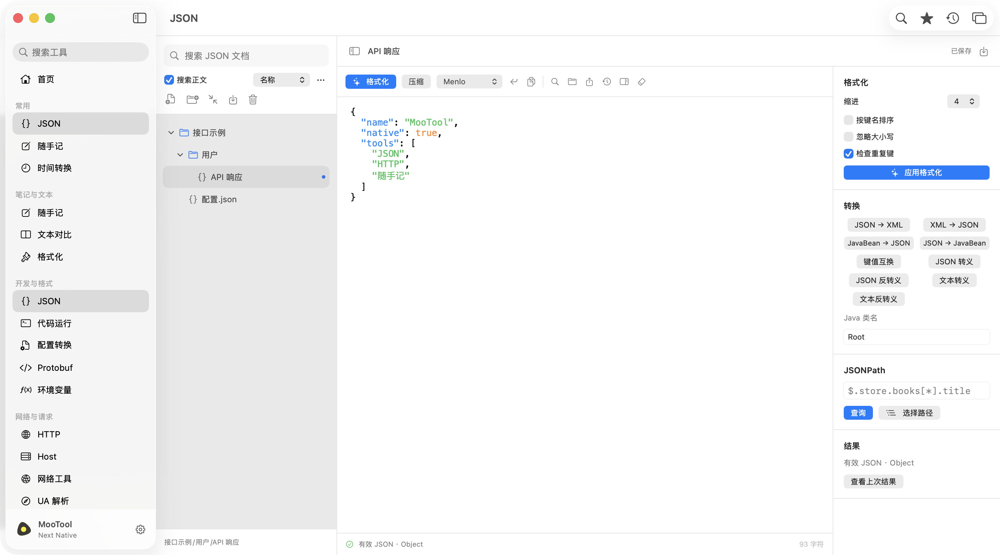

# MooTool Next macOS Native

`next-macos-native` 是独立的 macOS 产品线，使用 SwiftUI、AppKit 和系统框架实现。它沿用 `next` Electron 版的 26 个工具入口、分组导航和编辑工作区，并采用系统侧边栏、统一工具栏、原生菜单、深浅色和独立工具窗口。

当前版本为 **0.6.0**：随手记新增图片附件，支持选图、剪贴板粘贴、拖入多图，沿用 Electron 的选区替换、换行和顺序插入规则。图片可在分栏/预览中查看和缩放；文档副本保留引用，导出可携带附件，工作区备份恢复包含图片。应用和附件数据均保持独立。其余工具的能力与差异见 [功能对齐清单](docs/parity.md)。

功能和布局以 `next` Electron 版为基准：开发前对照对应页面与测试，保留功能入口、面板顺序及操作语义，再使用原生控件适配 macOS。这项约束已记录在 [AGENTS.md](AGENTS.md)。

## 界面



[深色首页](docs/screenshots/home-dark.png) · [窄窗口布局](docs/screenshots/json-compact.png)

[HTTP 工作区](docs/screenshots/http-light.png) · [JSON 路径选择](docs/screenshots/json-tree-light.png)

[JSON 深色检查器](docs/screenshots/json-inspector-dark.png) · [查找替换](docs/screenshots/json-find-light.png) · [转换结果](docs/screenshots/json-output-light.png)

[随手记分栏](docs/screenshots/quickNote-split-light.png) · [深色随手记](docs/screenshots/quickNote-split-dark.png) · [文档正文检索](docs/screenshots/json-search.png)

[随手记快速替换](docs/screenshots/quickNote-replace-light.png) · [Markdown 表格预览](docs/screenshots/quickNote-preview-dark.png) · [随手记窄窗口查找](docs/screenshots/quickNote-find-compact.png)

[图片分栏](docs/screenshots/quickNote-images-light.png) · [深色图片预览](docs/screenshots/quickNote-images-dark.png) · [窄窗口图片](docs/screenshots/quickNote-images-compact.png)

## 环境

- macOS 14+；系统自动翻译需要 macOS 15+ 和对应语言模型。
- 构建需要 Xcode 26 / Command Line Tools 26（macOS SDK 26、Swift 6.2+）；应用运行最低版本仍为 macOS 14。首次构建需联网解析固定版本的 Yams 6.2.2。
- Python、Node.js、Java、Groovy 等仅在运行对应代码时需要，不随安装包提供。
- 不需要启动 Electron、Tauri、Java 版 MooTool，也不需要它们的源码或用户数据。

## 开发与运行

```bash
cd next-macos-native
swift build
./scripts/run.sh
```

`run.sh` 创建带独立标识和资源的调试 `.app` 并打开它。也可在 Xcode 中打开 `Package.swift`，运行 `MooToolNextNative`。`swift run MooToolNextNative` 可用于快速开发，但正式使用应运行打包后的应用。

常用操作：

- `⌘K`：搜索工具；方向键选择、回车打开、Esc 关闭。
- `⌘Return`：执行当前工具的主要操作。
- `⌘F`、`⌘Z`：编辑器查找、撤销；保留系统复制、粘贴、选择操作。
- `⌘,`：设置；可调整主题、编辑器字号、自动换行和备份。
- 侧边栏右键：添加常用工具、打开独立窗口。
- JSON / 随手记：左侧依次为搜索、正文检索/排序、操作按钮、文件夹树和路径；支持新建文件/文件夹、展开折叠、重命名、移动、复制、删除。拖动项目到文件夹或空白根区域即可移动，也可用右键菜单选择目标。
- “更多”菜单可批量导入文件或文件夹；JSON 支持 `.json`，随手记支持 `.md/.markdown/.txt/.text/.log`，均为 UTF-8。保留导入层级，同名文件增加数字后缀；一次最多 500 份、总计 32 MB、单文件 10 MB，失败不会部分写入。隐藏文件、符号链接及不匹配类型不会从文件夹中导入。
- 编辑自动保存，`⌘S` 手动保存；记住文档选择、展开状态、搜索/排序、光标选择与滚动位置。切换文档隔离撤销记录，跨重启不保存撤销历史。未关联文档的内容可通过“打开草稿”找回。
- 随手记工具栏沿用编辑 / 分栏 / 预览三个模式；分栏默认左右各半，可拖动分隔条，双击恢复默认比例。JSON 正文、结果和查询路径按文档保存。窄窗口可通过左上角按钮打开文档库弹出面板。
- 随手记：文档颜色、10 种语法、系统字体/等宽字体/本机字体、8–48 号字号、1.0–2.0 倍行距和自动换行按文档保存。颜色标记文档树图标；正文保留系统配色及语法高亮。
- 随手记：查找栏支持大小写、全词、正则、前后导航和替换；右侧 24 项快速替换有选区时处理选区，否则处理全文。替换、列表插入及 JSON/XML 格式化均可撤销；切换预览继续保留编辑器。窄编辑区使用两行工具栏和快速替换弹出面板。详见 [随手记工作区与边界](docs/quick-note-workspace.md)。
- 随手记：保存按钮后是“插入图片附件”；也可粘贴剪贴板图片或拖入多图。插入会替换选区、补齐换行并切换为 Markdown，支持撤销与重做。点击预览图片可缩放；长图可滚动查看，丢失图片保留引用并显示提示。
- “更多”和文档右键菜单提供“导出文档及附件…”，创建包含 Markdown 与附件的新文件夹；普通文本导出仍可单独使用。设置中的“导出备份”将工作区及已登记的图片打包进 JSON。详见 [图片附件与备份](docs/note-attachments.md)。
- JSON：左侧文档库、中间主编辑器、右侧可折叠检查器。格式化/压缩直接更新正文且可撤销；高级格式化支持 2/4 空格、排序、忽略大小写和重复键检测。
- JSON：工具栏提供字体、换行、复制、查找替换、导入导出和历史。JSONPath 查询及 JSON → XML/JavaBean 在弹窗中显示结果；XML/JavaBean → JSON 先输入来源内容。支持筛选、递归、切片、联合查询和路径选择。详见 [JSON 工作区与解析边界](docs/json-engine.md)。
- HTTP：在参数、请求头、Cookie、正文之间切换；正文支持原始文本、JSON 和 URL 编码表单。URL 已有参数与编辑表格中的参数会合并，重复键保持顺序。
- HTTP 的 `…` 菜单可导入/复制 cURL、新建请求；点击“请求集合”打开本地保存的请求。保存包含所有请求参数和当前响应，同名替换需要在应用内确认。
- HTTP 响应可查看正文、响应头和 Cookie，支持 JSON 格式化显示、复制和导出。超时、重定向及正文类型随草稿、集合、历史与备份保存，切换工具后仍可取消进行中的请求。

## 独立构建与安装

```bash
./scripts/build-app.sh --dmg                  # 当前架构，Release
./scripts/build-app.sh --arch arm64 --dmg     # Apple Silicon
./scripts/build-app.sh --arch x86_64 --dmg    # Intel
./scripts/build-app.sh --arch universal --dmg
```

产物：

```text
dist/{arch}/MooTool Next Native.app
dist/{arch}/MooTool-Next-macOS-Native-0.6.0-mac-{arch}.dmg
dist/{arch}/build-info.json
```

把 **MooTool Next Native.app** 拖入 Applications 即可。应用名与其他产品不同，安装不覆盖 `MooTool.app` 或 `MooTool Next Electron.app`。构建脚本不会修改 Applications，也不会自动安装或卸载其他版本。

默认使用本地 ad hoc 签名，适合本机构建使用。公开分发时设置 `NATIVE_SIGN_IDENTITY` 使用 Developer ID 签名，并在发布流程中另行完成 Apple notarization；本脚本不上传签名密钥、不自动公证或发布 Release。

## 产品边界

| 项目 | 原生版值 |
| --- | --- |
| 产品 ID | `next-macos-native` |
| App 名称 | `MooTool Next Native.app` |
| Bundle ID / 偏好设置域 | `com.rememberber.mootool.next.macos-native` |
| 可执行文件 | `MooToolNextNative` |
| 数据目录 | `~/Library/Application Support/com.rememberber.mootool.next.macos-native/` |
| 版本来源 | `VERSION` |
| Tag | `next-macos-native-v{version}` |

源码、资源副本、构建、文档、版本和数据均位于本产品边界内。JSON 解析依赖、随手记文本算法及辅助程序随本产品打包，使用系统 JavaScriptCore，无需 Node.js。没有跨产品的源码导入、符号链接、共享数据库、自动迁移、公共偏好设置域或更新通道，也不依赖旧 `macos/` 原型。各版本可以独立演进和重复实现。

工作区保存输入、输出、文档、虚拟文件夹、请求内容、最近记录和收藏，写入为原子替换，目录/文件权限分别为 `0700` / `0600`。文档库层级保存在本产品的 `workspace.json` 中，导入是复制内容，后续编辑不会改写原始文件；导出时创建独立文本文件。图片单独保存在本目录的 `attachments/` 中，正常保存只写入附件记录；兼容读取 0.1.0–0.5.0 工作区。

这是本地工作区文件，不是加密密码库。解析损坏文件时暂停自动保存，保留原文件；备份只接受本产品及受支持的 schema，恢复前保存当前工作区与图片副本。工作区 JSON 上限 64 MB，携带图片的便携备份上限 192 MB；附件登记总量上限 64 MB。外观偏好与工作区备份分开保存，文档库搜索/排序/展开/视图状态包含在工作区备份内。

系统 Hosts 读取、环境查看不会修改机器配置。Hosts 提供检查和导出；环境变量草稿仅传给原生版代码运行子进程。网络请求和代码执行只由操作按钮触发。截图和屏幕取色走系统 UI；涉及系统权限时由 macOS 管理。

## 检查

```bash
./scripts/check-core.sh           # CLT 可运行：与 XCTest 相同的测试用例
swift test                       # 安装并配置完整 Xcode 后可用
./scripts/smoke.sh                # 需要登录桌面；76 个界面/主题渲染及实际编辑、重启恢复
./scripts/smoke.sh --window-capture # 完整窗口截图，包含系统工具栏和材质层
./scripts/smoke.sh --notes-only   # 仅随手记、附件交互及新进程恢复
./scripts/smoke.sh --window-capture --note-layouts-only # 仅随手记布局和图片分栏宽度回归
python3 scripts/verify-package.py # 构建 Universal DMG 后校验签名、资源和独立运行
```

`check-core.sh` 使用 `CoreTests.swift` 的同一组用例，解决 Command Line Tools 不包含 XCTest 的限制。没有接受 Xcode 许可时无需为了运行这些检查更改系统配置。

48 组核心测试覆盖输入输出和边界，包括图片格式/大小/路径校验、插入规则、附件副本/导出/备份恢复、全部 24 项快速替换、Unicode 选区、文档设置兼容和 Markdown 表格/列表。完整窗口模式额外捕获 JSON 结果弹窗的深浅色截图。截图和报告位于 `dist/acceptance/`；验收使用临时数据目录及 `.acceptance` 偏好域，不访问真实工作区。包含全部工具的双主题、JSON 结构树、随手记工具栏/快速替换/Markdown 预览、文档检索和窄窗口。验收还操作实际 NSTextView 与原生按钮，检查快速切换、选择/滚动、替换/列表撤销、预览切换、撤销隔离、多窗口设置同步、图片选图入口、粘贴/连续插入、附件撤销/重做、图片缩放和缺失占位，并启动第二个应用进程验证完整工作区及图片恢复。核心用例另外验证真实本机 HTTP 请求、重定向及独立 Cookie 会话。

本机环境、实际验证范围与安装包 SHA-256 见 [0.6.0 验收记录](docs/verification-0.6.0.md)。历史记录：[0.5.0](docs/verification-0.5.0.md) · [0.4.0](docs/verification-0.4.0.md)。

这些检查不等价于所有菜单、拖放及系统对话框的端到端测试。CI 独立构建原生版并上传产物，不使用仓库全局 Latest，也不影响其他产品发布。

目录说明：`Sources/MooToolNextCore` 为可测试逻辑；`Sources/MooToolNextApp` 为原生界面与系统集成；`Tests` 为核心测试；`scripts` 为构建、运行和验收入口。
