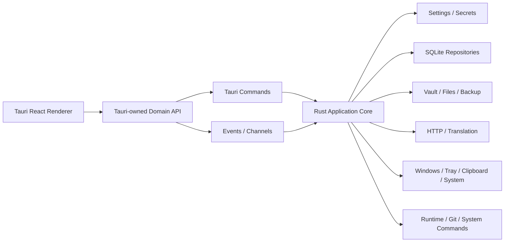

# MooTool Next Tauri 独立产品线实现方案

> - 状态：产品线已确定，全量开发中
> - 更新日期：2026-08-17
> - 产品 ID：`next-tauri`
> - 产品名称：MooTool Next Tauri
> - 目标技术栈：Tauri 2 + Rust + Vite + React + TypeScript
> - 产品关系：与 MooTool Java、MooTool Next Electron 并存，独立安装、独立更新、独立演进

## 0. 决策摘要

MooTool Next Tauri 是新的独立产品线，不是 MooTool Next Electron 的迁移目标、替代版本或轻量发行版。

本方案作出以下核心决策：

1. `next-tauri` 在自己的目录内维护完整源码、依赖、版本、测试、安装包和发布流水线，不在构建时引用 `next/src`、`next/electron` 或 Electron 构建产物。
2. Electron 可以作为 Tauri 首版的体验基线和功能验收参照，但不是 Tauri 的源码上游。Tauri 发布后拥有独立路线图，不要求与 Electron 锁步发版。
3. Tauri 使用独立应用 ID、用户数据目录、数据库、设置文件、密钥空间和更新节点，允许与 Java、Electron 同时安装和运行。
4. 产品间通过显式导入、导出和备份格式实现数据可携带，不默认共享正在使用的数据目录，不允许多个产品静默并发写入同一份数据库或 Vault。
5. Tauri 后端以 Rust 原生实现为正式方向，不以 Node.js Sidecar 承载长期业务后端。
6. Tauri 首版追求与 Electron 相近的功能、信息架构和操作心智，但允许在系统 WebView、窗口装饰、权限提示、更新安装方式等平台能力上采用 Tauri 自己的实现。
7. Tauri 产品线不再设置技术 Go/No-Go 立项闸门。系统 WebView、停靠/分离、截图取色等兼容性问题在正式开发中持续收敛；无法统一时采用平台实现、批准降级或调整单项功能，不影响产品线继续建设。

## 1. 产品定位与边界

### 1.1 产品关系

| 维度 | MooTool Java | MooTool Next Electron | MooTool Next Tauri |
| --- | --- | --- | --- |
| 产品 ID | `java` | `next-electron` | `next-tauri` |
| 技术路线 | Java / Swing | Electron / Chromium / Node.js | Tauri / 系统 WebView / Rust |
| 版本号 | 独立 | 独立 | 独立 |
| 安装与更新 | 独立 | 独立 | 独立 |
| 用户数据 | 独立 | 独立 | 独立 |
| 产品路线图 | 独立维护 | 独立维护 | 独立维护 |
| 其他产品的作用 | 历史功能与数据参考 | 当前体验参考 | 不替代其他实现 |

Tauri 首版可以选定一个已发布的 Electron 版本作为静态体验基线，例如 `next-electron 1.1.0`。基线只用于回答“首版应覆盖哪些用户流程、默认值和布局”，不形成长期从属关系。

Tauri 首次正式发布后：

- Tauri 可以先实现自己的平台优化或新功能。
- Electron 可以继续实现不适合 Tauri 的能力。
- 两个产品不要求版本号一致。
- 两个产品不要求同一天发布。
- 一个产品的缺陷修复不自动成为另一个产品的发布阻塞项。
- 跨产品同步需求通过独立 Issue、ADR 或兼容性任务明确追踪。

### 1.2 独立性硬约束

`next-tauri` 必须满足：

- 不从 `../next/src`、`../next/electron` 或 `../next/out` 导入源码和构建产物。
- 不复用 `next/package.json`、`next/package-lock.json`、Electron 的 Vite 配置或 Electron Builder 配置。
- 不以 Electron preload 的 150 个方法作为必须逐项复制的内部架构。
- 不读取 `update-manifest.json` 的 `next-electron` 节点。
- 不使用 Electron 的应用 ID、产品名、安装包名或更新 tag。
- 不把 Electron 用户数据目录作为 Tauri 默认数据目录。
- 不把“替换 Electron”“停止 Electron 维护”作为 Tauri 的完成条件。

允许共享的仓库级资源：

- 根目录品牌 Logo、图标源文件和许可证。
- [`RELEASE_CONVENTIONS.md`](../../RELEASE_CONVENTIONS.md) 等多产品公共规范。
- 产品中立的输入输出样本、协议说明、数据格式说明和兼容性测试夹具。
- 根目录发布清单的 Schema 与产品注册工具。
- 经单独评审后抽取到中立目录的纯规范或纯算法包。

如果未来需要建立跨产品共享库，应放在新的产品中立目录中，并通过 ADR 明确版本策略、兼容边界和退出方式。初始实现不为减少少量重复而让 Tauri 直接依赖 Electron 目录。

### 1.3 产品目标

1. 提供完整、稳定、可独立发布的桌面工具产品。
2. 首版在核心功能、布局层级、快捷键和数据语义上与选定体验基线尽量一致。
3. 利用 Rust 和系统 WebView 降低基础运行时体积与攻击面，但不预先承诺具体安装包大小和内存收益。
4. 保持 macOS、Windows、Linux 的核心功能一致，并为系统限制提供明确降级说明。
5. 支持从 Java 和 Electron 显式导入数据，导入过程不修改来源产品的数据。
6. 建立 Tauri 自己的产品质量、性能和发布基线。

### 1.4 非目标

- 不把 Electron 代码逐文件翻译成 Rust。
- 不追求 Electron 主进程内部结构、IPC 名称或依赖选择的完全一致。
- 不保证不同渲染引擎下每个像素完全相同。
- 不在首版支持移动端。
- 不以 App Store、Microsoft Store 上架作为首个正式版本的必要条件。
- 不默认支持 Tauri 与其他产品同时编辑同一个自定义数据目录。

## 2. 产品身份与发布隔离

### 2.1 建议的产品元数据

| 项目 | 建议值 |
| --- | --- |
| 产品 ID | `next-tauri` |
| 产品名 | `MooTool Next Tauri` |
| 应用 ID | `com.rememberber.mootool.next.tauri` |
| NPM 包名 | `mootool-next-tauri` |
| Rust crate 名 | `mootool-next-tauri` |
| 版本来源 | `next-tauri/package.json` |
| Git tag | `next-tauri-v{version}` |
| Release 标题 | `MooTool Next Tauri {version}` |
| Release Notes | `next-tauri/release-notes/{version}.md` |
| 更新产品节点 | `update-manifest.json` → `products.next-tauri` |
| 默认数据库 | `MooToolTauri.db` |
| 默认设置文件 | `mootool-tauri.json` |

版本号以 `next-tauri/package.json` 为唯一人工维护来源。构建脚本应将相同版本同步或校验到 Tauri 配置和 Rust 包元数据，CI 必须拒绝 tag、应用版本与 Release Notes 不一致的发布。

### 2.2 建议的首发安装包

| 平台 | 架构 | 包型 | 文件名示例 |
| --- | --- | --- | --- |
| macOS | arm64 | DMG | `MooTool-Next-Tauri-1.0.0-mac-arm64.dmg` |
| macOS | x64 | DMG | `MooTool-Next-Tauri-1.0.0-mac-x64.dmg` |
| Windows | x64 | NSIS | `MooTool-Next-Tauri-1.0.0-win-x64-setup.exe` |
| Linux | x64 | AppImage | `MooTool-Next-Tauri-1.0.0-linux-x64.AppImage` |
| Linux | x64 | DEB | `MooTool-Next-Tauri-1.0.0-linux-x64.deb` |

Windows MSI、Portable 以及 Linux RPM 可以在产品需求明确后增加，不作为首个技术验证阶段的前置条件。

### 2.3 `Latest` 规则

根据仓库级发布约定，在主力产品仍为 Electron 时：

- Tauri 正式 Release 使用 `make_latest: false`。
- Tauri 预发布版本标记为 pre-release。
- README 和官网为 Tauri 提供独立的最新版本入口。
- Tauri 客户端只读取 `next-tauri` 更新节点。
- 只有仓库级产品策略明确变更后，Tauri 才可以竞争全局 `Latest`。

## 3. “体验尽量一致”的定义

### 3.1 基线不是源码依赖

体验对齐以用户可观察行为为对象：

- 页面信息架构。
- 工具入口、分组、搜索和最近使用。
- 输入、输出、默认值、校验和错误反馈。
- 导入、导出、历史、收藏和设置。
- 快捷键、窗口行为和系统集成。
- 浅色、深色、最小窗口和三语言布局。

以下内容不要求一致：

- 内部函数、模块名和目录结构。
- Electron IPC Channel 名称。
- Electron 使用的 Node.js 库。
- Tauri Rust 服务的实现细节。
- 平台原生对话框和权限提示的细微视觉差异。

### 3.2 一致性级别

| 级别 | 要求 | 例子 |
| --- | --- | --- |
| A：必须等价 | 输入输出、数据格式、核心流程和安全边界等价 | JSON 转换、历史记录、Vault 路径限制 |
| B：尽量一致 | 信息层级、默认布局、操作顺序和快捷键一致 | 工具页、设置分类、搜索入口 |
| C：平台适配 | 使用 Tauri/系统提供的原生交互，允许外观差异 | 文件选择器、通知、系统菜单 |
| D：批准降级 | 系统能力无法稳定实现时提供说明和替代流程 | Linux Wayland 全局取色 |

所有 C、D 级差异必须记录在 Tauri 自己的 parity 文档中，不以 Electron 的实现状态代替 Tauri 验收。

### 3.3 首版功能基线

当前 Electron 注册表实际包含“首页 + 25 个功能工具”。仓库现有部分文档使用“24 个工具”的旧表述，Tauri 立项时应从实际注册表和可运行版本重新冻结一次功能清单，避免以历史计数作为验收依据。

建议按以下产品域组织 Tauri 首版：

| 产品域 | 功能 |
| --- | --- |
| 工作台 | 首页、导航分组、搜索、最近使用、设置、历史、收藏 |
| 文本与配置 | 随手记、文本对比、格式化、JSON、YAML/Properties |
| 开发工具 | 代码运行、Protobuf、环境变量 |
| 网络工具 | HTTP、Host、网络/IP、UA 分析 |
| 编码工具 | 编码解码、加解密/随机、Regex、Cron、二维码 |
| 日常工具 | 时间转换、留言板、翻译、计算器、调色板、图片、PDF |
| 系统工具 | 硬件与系统信息 |

## 4. 目标技术架构



### 4.1 建议目录

```text
next-tauri/
├── package.json
├── package-lock.json
├── tsconfig.json
├── vite.config.ts
├── index.html
├── README.md
├── doc/
├── release-notes/
├── resources/
├── src/
│   ├── app/
│   ├── features/
│   ├── platform/
│   │   ├── api/
│   │   ├── events/
│   │   └── contracts/
│   └── shared/
├── tests/
│   ├── unit/
│   ├── integration/
│   └── e2e/
└── src-tauri/
    ├── Cargo.toml
    ├── build.rs
    ├── capabilities/
    ├── icons/
    ├── src/
    │   ├── commands/
    │   ├── contracts/
    │   ├── repositories/
    │   ├── services/
    │   ├── platform/
    │   │   ├── macos/
    │   │   ├── windows/
    │   │   └── linux/
    │   ├── state.rs
    │   ├── lib.rs
    │   └── main.rs
    └── tauri.conf.json
```

### 4.2 Renderer

Tauri Renderer 是 Tauri 产品自己的 React 应用：

- 工具组件只依赖 `src/platform/api` 中的领域接口。
- 业务组件不直接调用任意 Tauri Command 名称。
- 业务组件不直接获得通用文件系统、Shell 或 SQL 接口。
- 平台事件在 `src/platform/events` 中统一订阅和释放。
- 长任务具有进度、取消和确定的生命周期。
- 工具 ID、数据结构和错误码由 Tauri 产品自己的契约管理。

Tauri 不需要复制 Electron 的 `window.mootool` 全局对象。可以使用更适合 Tauri 的模块化接口，但必须保持用户可观察行为和类型边界清晰。

### 4.3 Rust Application Core

Rust Core 负责：

- 窗口、菜单、托盘和应用生命周期。
- 设置和敏感信息。
- SQLite 连接、事务和迁移。
- 文件、Vault、备份和数据导入。
- HTTP、翻译、代理和请求取消。
- Git、外部运行时和系统命令。
- 截图、取色、剪贴板和系统权限。
- 自动更新状态与安装流程。

建议按领域拆分 Command，不创建一个可以接收任意 Channel 名称、任意路径或任意 Shell 命令的万能入口。

### 4.4 Command、Event 与 Channel

- 普通请求/响应：Tauri Command。
- 设置、主题、文件监视和窗口状态广播：Tauri Event。
- 代码运行输出、下载进度和未来的大响应流：Tauri Channel。
- 所有跨边界结构使用 `serde` 序列化。
- 前端契约优先通过生成式绑定维护；如果采用 Specta 等工具，版本和生成规则需由 ADR 固定。
- 生成文件应进入 Tauri 产品自己的源码或构建产物，不依赖 Electron 类型文件。

Tauri 官方文档：

- [Calling Rust from the Frontend](https://v2.tauri.app/develop/calling-rust/)
- [Calling the Frontend from Rust](https://v2.tauri.app/develop/calling-frontend/)

### 4.5 窗口与工具会话

建议的窗口模型：

1. 主窗口包含导航 Shell WebView。
2. 工具按需创建独立子 WebView。
3. 工具 WebView 在主窗口工作区内显示时保持自己的运行状态。
4. 分离工具时创建独立原生 Window，并使用 `Webview.reparent()` 移动同一个 WebView。
5. 收回工具时将同一个 WebView 移回主窗口。
6. 设置使用单实例窗口。
7. 截图和取色使用每显示器 Overlay 窗口。

该模型的目标是让工具在停靠和分离之间移动时不刷新、不丢输入和编辑器状态。Tauri 已提供 WebView 创建、定位、显示、隐藏和 `reparent()` API，但跨平台稳定性必须在 P0 阶段实测：

- [Tauri WebView API](https://v2.tauri.app/reference/javascript/api/namespacewebview/)

截至 2026-07-29 的 P0 实现结论：

- 当前锁定的 Tauri `2.11.5` 中，`Webview::reparent()` 是公开 API；但创建普通原生 `Window`、添加子 WebView 所需的 `WindowBuilder`、`WebviewBuilder` 和 `Window::add_child()` 仍要求开启 Tauri 的 `unstable` feature。
- 低层窗口能力集中在 Rust `ToolWebviewManager` 和领域 Command 中；Manager 以工具 ID 隔离 Calculator、CodeMirror 与状态探针会话，Shell 只传递停靠区域和生命周期意图，工具子页面无权调用生命周期 Command。
- Calculator 已作为首个正式独立工具 WebView 接入。macOS 26.6 / x86_64 / WKWebView 原生实测中，同一个 Calculator 页面完成手工分离/收回和 100 个往返周期，累计 202 次 `reparent` 操作；页面加载次数保持为 1，会话 ID、表达式 `123 * 7`、结果 `861`、进制字段和两条历史均保持。
- CodeMirror 6 已作为第二个独立工具 WebView 和系统 WebView 风险探针接入。macOS 原生实测中，中文拼音输入完整触发一次 composition 开始/结束并提交“测试”，Unicode 选区、外部查找和 CodeMirror 原生查找正常；分离/收回、隐藏/恢复及 100 个往返周期后页面加载仍为 1，会话、内容、选区、查找词和 IME 计数保持。
- Calculator 切到 Home 时只隐藏子 WebView，返回后同一会话恢复；工具栏关闭后可重新创建新会话。状态探针保留为低层回归入口，不再代替真实工具验收。
- 上述结果仅判定 macOS WKWebView 与中文拼音 IME 机制可行；日文字符显示正常但日文 IME 尚未实测，也不替代 Windows WebView2、Linux WebKitGTK 验证，或代表可以把 `unstable` API 当作无升级成本的长期承诺。

进入正式工具开发前，应锁定精确 Tauri/Wry 版本；每次升级必须重复 reparent 回归。在相关 API 稳定前，发布评审需把 `unstable` feature 视为明确的架构风险。

如果 `reparent()` 在任一首发平台无法达到稳定性门槛，必须在以下方案中作出明确产品决策：

- 推迟“工具分离”功能，不阻塞其他工具。
- 使用显式会话快照在新窗口恢复状态。
- 缩小首发平台范围。
- 如果无状态丢失是不可妥协要求，则暂缓 Tauri 正式发布。

## 5. 系统 WebView 与视觉策略

Tauri 使用操作系统 WebView：

- Windows：Microsoft Edge WebView2。
- macOS：WKWebView。
- Linux：WebKitGTK。

这能减少随应用打包的浏览器运行时，但意味着渲染、字体、滚动条、拖放、剪贴板和浏览器 API 存在平台差异：

- [Tauri Process Model](https://v2.tauri.app/concept/process-model/)

### 5.1 视觉目标

- 保持相同的信息层级、间距节奏、组件状态和操作位置。
- 不以跨渲染引擎逐像素一致作为发布门槛。
- 每个平台维护自己的视觉基线。
- 对字体抗锯齿、原生滚动条和系统对话框使用合理容差。
- 对遮挡、溢出、不可达控件和布局错位实行零容忍。

### 5.2 CSS 兼容性

立项时需要核验：

- `color-mix()`。
- `:has()`。
- `backdrop-filter`。
- `-webkit-app-region` 或 Tauri 拖拽区域替代方案。
- CodeMirror 在 WKWebView、WebView2、WebKitGTK 的选区、IME 和滚动行为。
- Canvas、图片处理和二维码相关 API。
- 外部文件拖放。
- Clipboard API 的安全上下文和权限行为。

不稳定的浏览器能力应通过 Tauri-owned Platform API 封装，不让工具页面直接依赖不同 WebView 的权限行为。

截至 2026-07-29，macOS WKWebView 已完成真实 CodeMirror 6 验证：中文拼音 composition、Unicode 选区、外部查找、原生查找、停靠/分离和状态保持通过。Windows WebView2、Linux WebKitGTK 及 macOS 日文 IME 仍是 P0 未完成项，不能从 macOS 中文结果外推。

### 5.3 macOS 外观

macOS 的透明标题栏和窗口背景可以通过 Tauri 窗口配置及必要的原生代码实现。完全透明 WebView 可能涉及 `macOSPrivateApi`，官方文档明确指出这会影响 Mac App Store 接受：

- [Tauri Window Customization](https://v2.tauri.app/learn/window-customization/)
- [Tauri WebView transparency](https://v2.tauri.app/reference/javascript/api/namespacewebview/)

因此必须在产品化前作出 ADR：

- 直接分发优先：允许使用私有 API，追求接近 Electron 的透明/毛玻璃效果。
- App Store 兼容优先：不使用私有 API，接受侧栏材质和透明度差异。

动态隐藏/显示 macOS 红绿灯属于非核心高成本细节。P0 应验证可行性，失败时可以使用始终可见的原生窗口按钮，并记录为批准差异。

## 6. Rust 服务方案

### 6.1 设置

建议在 Rust 侧维护版本化设置 Schema：

```text
schemaVersion
general
appearance
layout
editor
network
runtime
data
vault
shortcuts
tools
```

要求：

- 每个字段有默认值和合法范围。
- Schema 更新具有显式迁移。
- 设置写入使用临时文件和原子替换。
- 多窗口读取同一个 Rust 状态并通过事件同步。
- Renderer 不持有无需展示的敏感字段。

可以使用 `tauri-plugin-store`，也可以实现 Tauri 自己的 Rust Settings Repository。正式选型以原子写入、Schema 迁移和测试便利为准，不以插件数量最少为唯一目标。

### 6.2 敏感信息

代理密码、Git Token 等应存入操作系统凭证库，并使用 Tauri 产品自己的 service/account 命名空间。

官方 Stronghold 插件需要自己的 Vault 密码模型，未必与当前无额外密码提示的桌面体验一致。P0 期间应在以下方案间做 ADR：

- Rust `keyring` 对接 macOS Keychain、Windows Credential Manager、Linux Secret Service。
- Tauri Stronghold，并设计清晰的解锁与恢复体验。

不得把固定密钥、设备信息散列或普通设置值伪装成安全主密码。

### 6.3 SQLite

建议在 Rust Core 中使用 `rusqlite` 或经评审的等价 Rust 库：

- Renderer 不直接执行 SQL。
- Repository 暴露领域方法。
- 所有写操作使用事务。
- 数据库迁移包含回滚和损坏恢复测试。
- 兼容导入通过单独的只读连接处理。

不建议为了减少 Rust Repository 代码而把 `tauri-plugin-sql` 的通用执行权限开放给 Renderer。官方 SQL 插件可以用于技术验证，但正式架构仍应保持领域命令边界：

- [Tauri SQL Plugin](https://v2.tauri.app/plugin/sql/)

### 6.4 文件、Vault 与备份

- 使用 Rust 标准库/Tokio 文件接口。
- 所有用户相对路径先规范化，再在允许根目录内解析。
- 防止绝对路径、`..`、符号链接和大小写差异逃逸。
- 文件保存使用临时文件、刷新和原子替换。
- Vault 文件监控使用跨平台文件监视库，并在事件层去抖。
- Git 自动拉取和自动提交不得在编辑器有未保存内容时运行。
- 删除操作提供明确确认和可恢复策略。
- 导入前创建 Tauri 自己的备份。

### 6.5 Git

首版建议继续依赖系统 Git CLI，以保持与用户仓库、凭证和远程行为一致：

- Rust Core 生成受限参数。
- 禁止 Renderer 传入任意 Git 子命令。
- Token 通过临时 `GIT_ASKPASS` 或等价安全方式注入。
- stdout/stderr 结构化返回。
- 支持取消、超时和进程清理。
- 所有 Vault Git 操作在目标根目录内执行。

后续是否切换 `git2`/libgit2 作为 Tauri 独立路线图决策，不受 Electron 选择约束。

### 6.6 网络与翻译

建议使用 `reqwest`：

- 统一连接、读取和总超时。
- 支持显式代理、代理认证和不使用代理。
- 支持取消。
- 对重定向、Cookie、压缩、字符集和二进制响应建立 Golden Tests。
- HTTP 工具允许用户请求本地地址时，需要有独立的安全说明和限制策略。
- 更新检查只允许 HTTPS 和固定产品节点。

### 6.7 外部运行时

Java、Groovy、Python、Node.js 运行：

- 运行路径由设置或受控自动探测产生。
- 用户代码写入 Tauri 临时目录。
- 参数作为参数数组传递，不拼接 Shell 字符串。
- stdout/stderr 通过 Channel 流式返回。
- 支持停止、超时和应用退出清理。
- 工作目录必须存在并经过校验。
- Windows 进程树、Unix Process Group 需要平台级终止策略。

Tauri 官方支持 Sidecar，但 MooTool 的用户运行时是用户明确选择的本机命令，不需要把 Node/Python 作为应用业务后端一起打包：

- [Embedding External Binaries](https://v2.tauri.app/develop/sidecar/)

### 6.8 系统能力

以下能力需要平台模块：

- Hosts 读取与提权写入。
- 用户/系统环境变量。
- Ping、DNS、Whois、端口测试等白名单命令。
- 系统、CPU、内存、磁盘和网卡信息。
- 防止显示器休眠。
- 通知、托盘和关闭行为。

每个平台必须提供：

- 支持状态。
- 权限需求。
- 失败错误码。
- 用户可理解的失败提示。
- 单元或集成测试替身。

### 6.9 截图与取色

截图和取色不依赖 Renderer 直接读取整个桌面，应由 Rust 平台层完成。

建议方向：

- macOS：ScreenCaptureKit/CoreGraphics，并处理 Screen Recording 权限。
- Windows：Windows Graphics Capture 或经过验证的等价 API。
- Linux X11：X11 截图。
- Linux Wayland：优先 XDG Desktop Portal。

区域截图流程：

1. 记录当前可见的 MooTool 窗口。
2. 隐藏 MooTool 窗口。
3. 捕获每个显示器及缩放信息。
4. 为每个显示器创建 Overlay。
5. 用户选择区域。
6. 将逻辑坐标转换为物理像素并裁剪。
7. 恢复窗口和焦点。

Linux Wayland 可能无法支持无提示的持续屏幕像素读取，因此全局实时取色可以降级为“通过 Portal 获取截图后取色”，或在不支持时明确禁用。该差异必须在发布说明和工具页中展示，不能静默返回错误颜色。

## 7. Tauri 插件策略

优先考虑的官方能力：

| 能力 | 候选 |
| --- | --- |
| 文件/消息对话框 | `tauri-plugin-dialog` |
| 剪贴板图片与文本 | `tauri-plugin-clipboard-manager` |
| 打开 URL/路径 | `tauri-plugin-opener` |
| 通知 | `tauri-plugin-notification` |
| 窗口状态 | `tauri-plugin-window-state` 或自有状态服务 |
| 自动更新 | `tauri-plugin-updater` |
| 单实例 | `tauri-plugin-single-instance` |
| 日志 | `tauri-plugin-log` 或 Rust tracing |

使用原则：

- 只有 `src/platform` 可以直接调用 Guest Binding。
- 功能组件不得直接导入通用 FS、Shell、SQL 插件。
- 插件不是业务 Repository。
- 每个插件必须记录版本、维护状态、平台支持和权限。
- 社区插件进入正式产品前必须评估维护活跃度、许可证、权限范围和替代方案。
- 截图、系统信息和防休眠不因存在社区插件就跳过平台验证。

## 8. 权限与安全模型

Tauri 2 Capability 可以按窗口、WebView 和平台分配权限：

- [Tauri Capabilities](https://v2.tauri.app/security/capabilities/)

建议拆分：

| Capability | 目标 | 权限原则 |
| --- | --- | --- |
| `main-shell` | 主窗口 Shell | 窗口、菜单、导航和有限应用命令 |
| `tool-view` | 工具 WebView | 只允许工具所需领域命令 |
| `settings` | 设置窗口 | 设置、目录选择、备份、导入和凭证状态 |
| `screen-overlay` | 截图/取色 Overlay | 只允许读取本次会话快照和提交选择 |
| `updater` | 更新入口 | 检查、下载、安装当前 Tauri 产品更新 |

安全要求：

- 显式限制自定义 Command 的可调用窗口。
- 开启严格 CSP。
- 禁止远程页面访问本地 API。
- 外部链接由 opener 打开，不在拥有本地权限的 WebView 内导航。
- URL、路径、命令、扩展名和结构化输入均在 Rust 侧复验。
- 不允许任意 Shell 执行。
- 不允许任意数据库连接或 SQL。
- 不把 Secret 返回 Renderer。
- Release 构建默认关闭 DevTools。
- 更新包使用 Tauri 更新签名，并独立评估操作系统代码签名。

## 9. 数据隔离与产品间可携带

### 9.1 Tauri 自有数据

建议的默认数据结构：

```text
<tauri-app-data>/
├── mootool-tauri.json
├── MooToolTauri.db
├── images/
├── json-vault/
├── backups/
├── migration-backups/
├── pending-updates/
└── runtime/
```

数据根目录由 Tauri 的应用数据路径 API 基于 Tauri 应用 ID 解析。

### 9.2 不共享实时数据

默认禁止：

- Tauri 直接打开 Electron 正在使用的 `MooToolNext.db`。
- 两个产品同时监视并自动 Git 操作同一个 Vault。
- Tauri 把 Electron 设置文件当作自己的设置文件持续写入。
- 一个产品升级另一个产品的 Schema。

如果用户主动选择同一个外部 Vault：

- 显示并发风险提示。
- 使用跨进程锁或租约文件。
- 检测另一个 MooTool 产品是否正在使用。
- 默认关闭自动拉取、自动提交，直到用户明确确认。
- SQLite 数据库不支持这种共享模式。

### 9.3 显式导入

Tauri 可以分别提供：

- 从 MooTool Java 导入。
- 从 MooTool Next Electron 导入。
- 从 Tauri 备份恢复。
- 从未来的产品中立备份格式导入。

每个 Import Adapter 独立版本化：

```text
imports/
├── java/
├── next-electron/
└── next-tauri-backup/
```

导入流程：

1. 只读扫描来源。
2. 展示数据库、设置、Vault、图片和历史预览。
3. 检查来源版本和 Schema。
4. 创建 Tauri 当前数据备份。
5. 复制到临时位置并转换。
6. 在事务中导入数据库。
7. 校验数量、摘要和关键外键。
8. 原子切换。
9. 生成可查看的迁移报告。
10. 失败时回滚，不修改来源。

Electron `safeStorage` 内容不假定可由 Tauri 解密。代理密码和 Git Token 默认要求用户重新录入。

### 9.4 产品中立备份格式

建议在 Tauri 产品稳定后设计版本化的产品中立备份清单：

```json
{
  "schemaVersion": 1,
  "sourceProduct": "next-tauri",
  "sourceVersion": "1.0.0",
  "createdAt": "2026-07-29T00:00:00Z",
  "items": []
}
```

该格式可以成为产品间显式携带数据的协议，但不能要求所有产品直接共享内部数据库 Schema。

## 10. 自动更新与发布

### 10.1 更新模型

Tauri 保留仓库根 `update-manifest.json` 作为产品注册与多版本说明来源，只读取 `products.next-tauri`。

Tauri Updater 要求更新包使用独立签名，且验证不能关闭：

- [Tauri Updater](https://v2.tauri.app/plugin/updater/)

建议发布流水线：

1. 解析 `next-tauri-v{version}`。
2. 校验 `next-tauri/package.json` 和 Release Notes。
3. 构建、测试并打包各平台产物。
4. 使用 Tauri 更新私钥签名更新产物。
5. 上传安装包、签名和更新元数据。
6. 校验所有 Release URL 可访问。
7. 创建 Tauri GitHub Release，`make_latest: false`。
8. 只更新 `update-manifest.json` 的 `next-tauri` 节点。
9. 必要时从根清单生成 Tauri Updater 使用的 `latest.json`。
10. 验证旧 Tauri 客户端只能发现 Tauri 新版本。

更新私钥必须存放在 CI Secret 中并具有离线备份。Tauri 更新签名与 Apple Developer ID、Windows Authenticode 是不同安全层，不能互相替代。

### 10.2 独立 CI

建议新增：

```text
.github/workflows/next-tauri-check.yml
.github/workflows/next-tauri-build-installers.yml
```

触发边界：

- 普通检查：`next-tauri/**`、明确的产品中立资源或公共发布工具变更。
- 正式发布：只由 `next-tauri-v*` tag 触发。

CI 至少包含：

- `npm ci`。
- TypeScript typecheck。
- Vitest。
- `cargo fmt --check`。
- `cargo clippy -- -D warnings`。
- `cargo test`。
- Rust/TypeScript 契约一致性检查。
- Tauri E2E。
- 三平台安装包矩阵。
- 安装后启动验证。
- 产物命名、架构和更新签名校验。

## 11. 测试与验收体系

### 11.1 测试分层

| 层级 | 目标 |
| --- | --- |
| TypeScript 单元测试 | 纯算法、组件状态、格式化和输入校验 |
| Rust 单元测试 | Path、命令构造、解析、错误映射和平台抽象 |
| Rust 集成测试 | SQLite、Vault、备份、迁移、Git、网络和运行时 |
| Renderer Mock 测试 | 用 Mock Platform API 验证工具流程 |
| Tauri E2E | 真窗口、真 Command、真数据库和关键系统行为 |
| 安装验收 | DMG、NSIS、AppImage、DEB 的安装、启动和更新 |
| 人工平台验收 | 权限、提权、托盘、截图、多显示器和系统差异 |

Tauri 官方当前推荐 WebdriverIO Tauri Service，支持 Windows、Linux 和 macOS：

- [Tauri WebDriver](https://v2.tauri.app/develop/tests/webdriver/)

Tauri E2E 是 Tauri 产品自己的测试套件，不直接运行 Electron Playwright Harness。可以参考其用户流程，但需要重新实现驱动和断言。

### 11.2 视觉基线

每个工具至少保存：

- macOS 1440 × 920 浅色。
- macOS 1440 × 920 深色。
- Windows 1440 × 920 浅色。
- Linux 1440 × 920 浅色。
- 1080 × 720 最小窗口。
- 三语言长文案。
- 关键对话框和错误状态。

首版验收以“结构和可用性一致”为目标：

- 控件无重叠。
- 主要区域顺序一致。
- 不出现不可达操作。
- 工具切换不丢未提交状态。
- CodeMirror 光标、选区、IME 和查找正常。
- 字体抗锯齿差异不计为缺陷。

### 11.3 性能基线

不在实现前承诺“必然比 Electron 快多少”。P0 和发布候选版本必须记录：

- 冷启动时间。
- 主窗口可交互时间。
- 空闲 RSS。
- 打开 1、10、全部工具后的 RSS。
- 工具停靠/分离耗时。
- 10 MB JSON 打开和格式化耗时。
- Quick Note 大目录扫描耗时。
- 100 MB 文件摘要耗时。
- 安装包和安装后体积。

Tauri 使用系统 WebView 通常能减小安装包，但多 WebView、Rust 依赖和前端资源仍可能显著影响内存与体积：

- [Tauri App Size](https://v2.tauri.app/concept/size/)

## 12. 持续兼容性跟踪（非开发闸门）

本节保留原 P0 风险清单作为工程跟踪依据。根据 2026-07-29 的产品决策，这些项目不再决定 Tauri 产品线是否继续，也不要求在正式工具开发前全部完成。兼容性任务按功能依赖和发布节奏穿插处理。

### 12.1 验证范围

1. 独立 `next-tauri` 工程、应用 ID 和数据目录。
2. React/Vite 基础工作台和系统主题。
3. 主窗口、设置窗口、托盘和关闭行为。
4. Calculator 工具 WebView 的创建、停靠、分离和收回。
5. 同一个工具 WebView 连续 `reparent()` 100 次，不刷新、不丢输入。
6. 主窗口 Overlay 打开时隐藏和恢复工具 WebView。
7. CodeMirror 输入、中文/日文 IME、选区和查找。
8. Quick Note 文本保存、图片粘贴和外部图片拖放。
9. SQLite 历史记录的读写和重启恢复。
10. Node.js 示例代码的运行、流式输出、停止和超时。
11. 单显示器、多显示器、不同缩放比例下的区域截图。
12. macOS、Windows 全局取色；Linux X11 和 Wayland 的支持/降级结论。
13. 1440 × 920、1080 × 720 的布局与视觉基线。
14. 三平台最小安装包构建和启动。

### 12.2 发布前质量目标

- 三个平台均能启动独立安装包。
- 工具停靠/分离达到稳定性测试门槛。
- CodeMirror 和 IME 没有阻断性缺陷。
- 数据、运行时输出和窗口状态可恢复。
- macOS、Windows 截图与取色可达到发布质量。
- Linux 有可接受的截图路径，Wayland 降级被产品负责人批准。
- 未发现必须把 Node Sidecar 作为长期后端的阻塞项。
- 权限模型能做到不向 Renderer 暴露通用 Shell/FS/SQL。

### 12.3 兼容性处理原则

- 工具 WebView 在任一首发平台频繁重载、崩溃或丢状态。
- WKWebView/WebKitGTK 无法稳定运行关键编辑器或算法依赖。
- 多显示器截图坐标无法在目标系统稳定校准。
- Linux 降级范围超过产品可接受程度。
- 安装签名、权限或系统依赖使目标发行渠道不可行。
- 为达到体验目标必须引入与 Electron 等量的 Node/Chromium 运行时。

出现上述问题时，优先修复；不能及时统一时，采用平台专用实现、显式降级、调整单项功能或调整首发平台范围。兼容性结论影响对应功能的发布范围，不重新讨论 Tauri 产品线是否存在。

## 13. 分阶段实施

### 工程基线（已完成）

范围见上一节。

**成果**：独立工程、产品边界、Rust-owned 工具 WebView 管理、Calculator 与 CodeMirror 基线已经建立；后续兼容性验证转入持续工程任务。

### P1：独立工作台与桌面基础

- 完整工程结构。
- 首页、导航、搜索、最近使用和自定义分组。（已交付，自定义分组进入独立设置 Schema）
- 设置 Schema 与设置窗口。
- 主题、三语言、快捷键。
- 主窗口状态、关闭策略、托盘和菜单。
- Tauri-owned API、错误模型和事件模型。（已交付结构化 `AppError`、前端统一归一化与错误上报）
- Capability、CSP 和日志。（已交付每日 JSON 日志、脱敏与 14 天留存）

**出口条件**：Tauri 作为独立产品可以日常开发、测试和打包。

### P2：纯本地工具

- 文本对比。
- 格式化。（已交付 Nginx/Java/XML/HTML）
- YAML/Properties。（已交付双向转换、格式化与校验）
- Protobuf。（已交付 proto2/proto3、JSON/Base64/Hex 与 Wire 检查）
- UA 分析。（已交付浏览器、引擎、系统、设备与 Bot 分类）
- 编码解码。（已交付 Unicode/URL/Base64/Hex/ASCII）
- 加解密/随机。（已交付摘要/HMAC、AES-256-GCM、PBKDF2 与安全随机）
- Regex。（已交付表达式测试、捕获组、常用库和替换预览）
- Cron。（已交付 Quartz 构建、说明与未来执行计划）
- 二维码。（已交付 SVG 生成、样式配置、图片识别与下载）
- 时间转换。（已交付 Unix 秒/毫秒、IANA 时区与 DST）
- 留言板。（已交付全屏文字演示、预设、主题、对齐、自动缩放、常用消息与演示防休眠）
- 计算器。
- 调色板。（已交付格式转换、色阶与 WCAG 对比度）

优先使用 Tauri 自己的 Golden Fixtures 验证输入输出，不以复制 Electron 测试文件作为完成条件。

**出口条件**：纯本地工具完成三语言、主题、历史/收藏和视觉验收。

### P3：数据、文件与媒体

- SQLite Repository。（已交付独立数据库、Schema 初始化与笔记/留言 Repository）
- 通用历史和收藏。
- JSON 与 JSON Vault。（已交付安全目录边界、指纹冲突保护、原子保存、文件监控与可恢复删除）
- Quick Note。（已交付 SQLite 数据库优先模型、自动保存、全文搜索、查找替换、分栏预览与受控原生文本导入导出；不复用 Electron 文件树/Git 工作区，见 ADR-011）
- 文件导入导出。（已交付随手记和 Host 文本文件的 Rust-owned 原生选择与保存边界）
- 图片仓库和处理。
- PDF 拆分合并。（已交付页码选择、排序、取消，以及单文件 200 MiB/批次 500 MiB 上限的 Rust-owned 分块原生导出）
- Vault Git。（已交付系统 Git 固定操作、超时、取消、脏编辑保护与可选自动提交）
- 备份与恢复。（已交付 v2，覆盖数据库、设置、图片和 Vault；Vault 恢复到 Tauri 自有导入目录）
- Java/Electron 显式导入。（已交付独立适配器：只读双重指纹扫描、凭据跳过、导入前完整备份、SQLite 事务、幂等标记与迁移报告）

**出口条件**：数据闭环、备份、回滚和导入报告通过集成测试。

### P4：网络、系统与运行时

- HTTP。（已交付 Rust 请求、参数/Header/Cookie、正文类型、超时、cURL、取消、SQLite 收藏/响应快照与最近 500 条历史）
- 翻译、单词本和翻译历史。
- Host Profile 与系统 Hosts。
- 网络/IP 工具。
- 环境变量。
- 系统与硬件信息。
- Java/Groovy/Python/Node.js 运行。
- 代理、超时、取消和错误码。

**出口条件**：三平台核心能力一致，提权和权限失败具有可理解提示。

### P5：高风险桌面体验

- 完整工具停靠/分离。
- 多显示器截图。（已交付隐藏应用、多显示器快照、显示器切换、物理像素区域选择与临时资产清理）
- 取色。（已交付显示器快照实时预览、HEX/RGB/坐标与单击确认）
- 防显示器休眠。（已交付 Rust owner 隔离 token）
- macOS 透明/毛玻璃和窗口按钮策略。（已由 ADR-010 固定为原生 Overlay 标题栏、保留系统按钮、不启用私有透明 API）
- Windows DPI 和拖放。（已交付 Tauri 原生路径拖放及 Rust 文件校验；多缩放人工验收保留在发布矩阵）
- Linux X11/Wayland 降级。（已交付 X11/可用桌面会话路径和明确失败提示；Wayland Portal Overlay 后续增强）
- 自动更新。（已交付独立通道、签名验证、进度、取消、安装与重启）

部分能力已在 P0 验证，P5 负责生产化、错误恢复和全面验收。

**出口条件**：所有批准差异有文档，关键原生能力通过人工平台验收。

### P6：产品化与首发

- 独立 Release Notes。
- `next-tauri-v*` 发布流水线。
- Tauri 更新签名。
- macOS arm64/x64、Windows x64、Linux x64 安装包。
- 安装、升级、降级拒绝和卸载测试。
- 产品页、下载入口和平台限制说明。
- `update-manifest.json` 中 `next-tauri.status` 从 `planned` 切换为 `active`。

**出口条件**：完成 `next-tauri 1.0.0` 发布，不影响 Java 和 Electron 产品。

## 14. 风险清单

| 风险 | 等级 | 缓解措施 |
| --- | --- | --- |
| 系统 WebView 渲染差异 | 高 | P0 三平台视觉、IME、CodeMirror 验证；明确最低系统版本 |
| WebView `reparent()` 稳定性 | 高 | 100 次循环、多个工具、焦点和重启测试；准备会话快照备选 |
| 截图和取色 | 高 | 平台原生实现；Wayland Portal 降级；权限引导 |
| macOS 透明与 App Store 冲突 | 高 | ADR 决定直接分发或 Store 兼容优先 |
| Hosts/环境变量提权 | 高 | 平台 helper、白名单输入、签名与人工验收 |
| Rust 重写业务语义偏差 | 中高 | Golden Fixtures、兼容样本、领域集成测试 |
| 产品间数据冲突 | 高 | 独立数据目录、显式导入、单写者锁 |
| 更新密钥丢失 | 高 | CI Secret + 离线备份 + 密钥轮换预案 |
| Linux 发行版差异 | 高 | 明确支持矩阵；AppImage/DEB 实机验收 |
| 插件维护或权限过宽 | 中 | 优先官方插件；版本锁定；最小 Capability |
| Tauri/Electron 体验长期漂移 | 中 | 独立路线图 + 周期性体验评审，不建立源码耦合 |
| 重复实现增加维护成本 | 中 | 共享产品中立规范和 Fixtures；禁止隐式跨目录依赖 |

## 15. 人力与周期预估

在 P0 通过的前提下：

| 阶段 | 单人预估 |
| --- | --- |
| P0 | 1–2 周 |
| P1 | 1–2 周 |
| P2 | 2–3 周 |
| P3 | 2–4 周 |
| P4 | 2–4 周 |
| P5 | 2–4 周 |
| P6 | 1–2 周 |

单个熟悉 Rust/Tauri 的工程师完成首版预计约 11–21 周。两名工程师可以并行前端工具和 Rust Core，但截图、窗口、发布等平台工作仍存在串行依赖，预计约 7–12 个自然周。

估算不包含：

- 购买 Apple/Windows 代码签名凭证。
- 外部翻译服务变更。
- 大规模重新设计 UI。
- 移动端。
- App Store/Microsoft Store 审核周期。

## 16. ADR 状态

P0 结束前至少需要作出：

1. **ADR-001：最低支持系统版本**
   基于实际 WebView 和 CSS 能力确定 macOS、Windows、Linux 基线。
2. **ADR-002：工具窗口状态模型**
   采用 WebView reparent、状态快照，或首版不支持分离。
3. **ADR-003：Secret Store**
   OS Keyring 或 Stronghold。
4. **ADR-004：macOS 外观与发行渠道**
   私有 API/直接分发，或 Store 兼容。
5. **ADR-005：截图与取色平台实现**
   原生 API、Rust crate 组合以及 Wayland 降级。
6. **ADR-006：SQLite Library**
   `rusqlite`、SQLx 或其他方案。
7. **ADR-007：契约生成**
   手写 TypeScript/Rust 契约或生成式绑定。
8. **[ADR-008：自动更新清单](adr/008-updater-manifest.md)（已采纳）**
   根产品清单负责产品发现，Tauri 静态 `latest.json` 负责平台更新；已发布版本通过独立提升工作流建立两者关系。
9. **[ADR-009：代码签名策略](adr/009-code-signing.md)（已采纳）**
   Updater 签名始终强制；0.x 预览允许明确披露的操作系统层未签名/ad-hoc 包，正式受信任分发要求 Apple/Windows 代码签名材料。
10. **ADR-010：跨产品备份格式**
    是否以及何时建立产品中立数据包。

## 17. 首个正式版本完成定义

`MooTool Next Tauri 1.0.0` 只有在以下条件全部满足后才能发布：

- 产品身份、应用 ID、数据目录和更新节点与其他产品隔离。
- P0 Go 条件全部满足，或差异已书面批准。
- 首版冻结的功能清单具有逐项验收记录。
- 简体中文、英文、日文完整。
- 浅色、深色、最小窗口通过。
- 数据导入不会修改 Java/Electron 来源。
- 数据库、Vault、备份和恢复具有集成测试。
- 主窗口、设置、托盘、关闭策略和快捷键通过验收。
- 代码运行、网络请求和长任务支持取消。
- 截图/取色具有平台支持说明。
- Capability、CSP、路径和命令边界完成安全审查。
- Tauri Updater 签名验证通过。
- 所有目标安装包可安装并首次启动。
- Tauri Release 不覆盖仓库全局 `Latest`。
- 发布和更新不会修改 Java、Electron 的版本、Release 或清单节点。
- Release 正文明确说明：Tauri 与 Java、Electron 独立安装、独立更新，不替代其他实现。

## 18. 近期下一步

已完成产品独立性边界确认、独立工程初始化、macOS Calculator/CodeMirror 基线、正式 JSON 与文本对比工作台、Rust-owned 版本化设置与 SQLite 数据基础设施，以及格式化、配置转换、编码解码、Regex、Cron、时间转换、UA、密码学/随机、二维码、Protobuf、颜色、随手记、留言板、环境变量、网络/IP 和硬件系统。后续以正式功能交付为主线：

1. Tauri 1.0 功能基线已冻结为 25 个正式工具；CodeMirror/WebView 实验台作为工程入口，不进入产品计数，详见 `doc/feature-baseline.md`。
2. 设置 Schema、独立原子持久化、单实例设置窗口、三语言基础设施、主题和跨 WebView 同步已完成；25 个正式工具均已建立强类型消息目录并完成动态状态、错误、确认提示、示例内容和宿主加载态迁移，共享历史面板与原生 WebView 宿主同步覆盖。目录测试校验中/英/日键、空文案和插值参数，产品覆盖测试保证正式工具清单与消息目录一一对应。Rust-owned 窗口状态、原生菜单/托盘、关闭策略和登录启动也已交付。统一 IPC 错误模型、前端异常上报、每日结构化日志与脱敏诊断导出已经形成闭环。
3. 二十五个正式工具已全部交付；翻译、图片和 PDF 已进入正式产品，后续按独立产品路线持续增强，不与 Electron 版本绑定发布节奏。
4. SQLite 独立数据库、随手记、留言板、Host 配置档案、翻译单词本/历史、图片索引、工具收藏、通用操作历史及自定义分组已交付。JSON Vault 与受限 Vault Git 已进入正式 JSON 工作台；完整备份 v2 覆盖数据库、设置、图片和 Vault，并在导入前保留回滚副本，导入 Vault 不覆盖原外部目录。Java/Electron 显式导入适配器已交付：来源只读、预览后变化拒绝、凭据跳过、写入事务化且生成独立报告。
5. 独立 CI、`next-tauri-v*` 多平台 Draft Pre-release、Tauri 更新签名、产品专属静态更新通道及发布后提升工作流已交付；本地 macOS x64 已通过 DMG/签名/首次启动验收，Windows、Linux 与 macOS arm64 由发布矩阵执行安装和首次启动冒烟。
