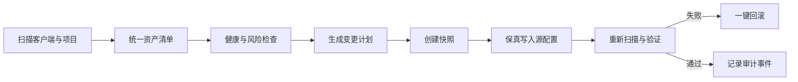

# AI 时代开发者工具规划

> 适用目录：`/next`  
> 规划日期：2026-07-17  
> 性能基线更新：2026-07-18，后续本地验收以当前 Intel MacBook 为主要开发机  
> 产品方向：在现有 MooTool 本地开发者工具箱中增加一组“AI 工作台”能力，统一管理开发者机器和项目中的 AI 编码配置。

## 1. 产品结论

MooTool Next 不再做一个新的 AI 聊天客户端，而是做 AI 开发环境的本地控制台：

1. 发现本机安装的 AI 编码客户端及其用户级、项目级配置。
2. 将 Skill、项目规约、MCP、Token 用量和 Agent 配置放在同一工作台中管理。
3. 修改前展示变更计划，修改时保留原格式和未知字段，修改后可以验证与回滚。
4. 默认本地处理；凭证进入系统安全存储，敏感内容不进入普通配置、日志和 Renderer。
5. 先把 Codex 与 Claude Code 做完整，再通过 Adapter 扩展 Cursor、Gemini CLI、VS Code/GitHub Copilot。

一句话定位：**MooTool AI Workbench 是 AI 编码工具的配置、能力、成本与安全控制面。**

## 2. 为什么值得做

AI 编码工具的能力正在拆成几类文件和运行时：

- 常驻项目上下文：`AGENTS.md`、`CLAUDE.md`、`GEMINI.md`、Cursor Rules、Copilot Instructions。
- 按需工作流：以 `SKILL.md` 为入口的 Skill 目录。
- 外部工具与数据：MCP Server 及其命令、URL、环境变量和 OAuth 授权。
- 执行主体：不同客户端中的 Agent、Subagent、Profile、权限模式和模型配置。
- 可观测性：输入、输出、缓存 Token、调用次数、金额、项目和模型维度用量。

这些配置分散在用户目录、项目目录和多个文件格式中。直接手改会遇到作用域不清、重复配置、密钥泄露、版本差异、无法回滚、上下文膨胀和成本不透明等问题。MooTool 已具备 Electron 主进程、typed IPC、SQLite、本地 Vault、`safeStorage`、备份和迁移能力，适合承接这个控制面。

本规划采用以下当前官方约定作为适配基线：

- OpenAI 将 Skill 定义为包含 `SKILL.md` 和可选脚本、参考资料、资源的可复用工作流；Codex 使用仓库中的 `AGENTS.md` 接收项目指令。
- Claude Code 区分 `CLAUDE.md`、Rules、Skills、Subagents 和 MCP，并支持用户、项目与插件等不同作用域。
- Cursor CLI 与 IDE 共享 Rules 和 MCP 配置。
- MCP 当前标准传输以 stdio 和 Streamable HTTP 为主；远程授权需要安全存储 Token，并遵循 OAuth 与资源绑定要求。
- OpenAI Usage/Costs API 已区分 Token 用量和财务成本；产品中也必须区分“估算金额”和“账单金额”。

官方参考见第 16 节。每个适配器都要记录自己验证过的客户端版本，不能假设不同版本长期保持相同文件格式。

## 3. 信息架构

在现有导航增加一级分组“AI 工作台”，不把新能力塞进“开发”分组。

| 工具 ID | 中文名称 | 核心问题 | 首发级别 |
| --- | --- | --- | --- |
| `aiOverview` | AI 总览 | 我的 AI 开发环境是否健康，有哪些风险和待处理项 | P0 |
| `skillManager` | Skill 管理 | Skill 在哪里、是否有效、由谁使用、如何安全安装与同步 | P0 |
| `instructionManager` | 编码规约 | 各层指令如何生效，是否冲突、重复或占用过多上下文 | P0 |
| `mcpManager` | MCP 管理 | Server 是否可用、暴露什么能力、凭证与配置是否安全 | P0 |
| `usageDashboard` | Token 与成本 | Token 花在哪里、成本是否异常、预算是否接近阈值 | P0 |
| `agentManager` | Agent 管理 | 本机有哪些 Agent/客户端、配置是什么、能力是否完整 | P0 |
| `contextInspector` | 上下文检查 | 会话启动时和按需加载时，哪些内容消耗上下文 | P1 |
| `promptLab` | Prompt 与评测 | Prompt/Skill/规约改动是否让结果更稳定、更省 Token | P2 |

导航不为“模型管理”“密钥管理”单独建工具：

- 模型是 Agent Profile 和 Usage 的筛选维度。
- 密钥只在对应 MCP、用量数据源或 Provider 设置中管理，并统一由安全中心审计。
- Prompt 模板若只是一次性文本，复用 Quick Note；只有带变量、测试集和对比运行时才进入 Prompt Lab。

## 4. 核心用户工作流



所有写操作共用这一条链路，不允许每个功能各自直接写配置文件。

典型用户旅程：

1. 用户选择一个 Git 项目或打开“本机环境”。
2. MooTool 检测 Codex、Claude Code 等客户端，展示版本、配置路径和健康状态。
3. 用户在规约管理中看到根目录 `AGENTS.md`、子目录指令和 `CLAUDE.md` 的作用域树。
4. 用户选择“生成 Claude 兼容入口”，预览将要创建的 `CLAUDE.md`，确认后写入。
5. 用户在 MCP 管理中将一个 Server 从 Codex 同步到 Claude；密钥只生成占位符映射，不复制明文。
6. 用户运行连接测试，看到 Server 的 tools/resources/prompts 数量、启动耗时和脱敏日志。
7. Token 面板将本地会话统计与 Provider 账单数据分开呈现，并按项目、客户端、模型聚合。

## 5. Skill 管理

### 5.1 P0 能力

- 扫描用户级与项目级 Skill，展示来源客户端、作用域、目录、名称、描述、文件数和最近修改时间。
- 解析 `SKILL.md` YAML frontmatter 与 Markdown，校验必需字段、目录名、引用文件和重复名称。
- 以树形方式查看 `SKILL.md`、`scripts/`、`references/`、`assets/` 等资源。
- 编辑、复制、启用/停用、移动作用域；所有修改都先预览 diff。
- 从本地目录或 Git URL 安装；先拉取到隔离临时目录，展示清单后再安装。
- 检测断开的相对链接、缺失脚本、过大的入口文件、疑似密钥和危险命令模式。
- 估算 Skill 元信息的常驻 Token，以及 Skill 被调用后加载的正文 Token。
- 导出为可审查的 ZIP 或目录，不包含本机凭证和绝对私有路径。

### 5.2 P1 能力

- 同一 Skill 向 Codex/Claude Code 的兼容目录发布，展示目标差异和不支持字段。
- 根据模板创建 Skill，并提供“最小入口 + 按需 references”的上下文优化建议。
- 对比两个版本，展示入口、资源、脚本和权限变化。
- Git 来源的版本检查、更新预览、锁定 commit 和回退。
- 项目 Skill Pack：将多个 Skill 作为一个可版本化集合启用。

### 5.3 明确不做

- 首版不提供未经审核的一键远程市场安装。
- 静态检查只标记风险，不承诺证明第三方 Skill 安全。
- 扫描和预览阶段不执行 Skill 中的任何脚本、Hook 或安装命令。

## 6. 编码规约管理

“编码规约”在界面中使用更易懂的名称，数据模型中称为 Instruction Artifact。

### 6.1 支持对象

首批：

- Codex：`AGENTS.md` 及其目录作用域。
- Claude Code：用户、项目与本地 `CLAUDE.md`，以及 `.claude/rules/`。

后续：

- Cursor：`.cursor/rules/`。
- Gemini CLI：`GEMINI.md` 及配置的上下文文件。
- VS Code/GitHub Copilot：仓库 Instructions 与路径级 Instructions。

### 6.2 核心能力

- 作用域树：按“组织/用户 → 仓库 → 子目录 → 本地覆盖”展示生效顺序。
- 生效预览：选择一个目标文件，展示该路径最终会加载的指令集合。
- 规约编辑：Markdown 编辑、目录选择、路径匹配、启用状态与适用客户端。
- 冲突检查：识别互斥要求，例如不同缩进、测试命令、禁止/必须操作。
- 重复检查：标记多个文件中高相似度的段落，建议保留单一事实源。
- Token 预算：区分会话常驻指令与按路径/按需加载内容，给出压缩建议。
- 兼容生成：以 `AGENTS.md` 为团队通用源时，可以生成很薄的客户端入口；生成内容始终可审查，不强制覆盖用户已有文件。
- 初始化向导：从 `package.json`、构建脚本、CI 和目录结构生成候选规约，但必须由用户选择后才写入。

### 6.3 设计原则

- 不发明 MooTool 私有规约格式作为唯一真相；源文件仍是各客户端原生文件。
- “统一编辑”是视图，不代表所有客户端语义可以无损互转。
- 客户端私有扩展保留在 Adapter 扩展字段中，并在跨客户端同步时明确标记丢失风险。
- 未识别的 frontmatter、注释、字段顺序和格式尽量原样保留。

## 7. MCP 管理

### 7.1 P0 能力

- 从支持的客户端配置中发现 MCP Server，统一显示名称、来源、作用域、传输、状态和风险等级。
- 支持 stdio 与 Streamable HTTP；旧 SSE 配置只做兼容读取和迁移提示。
- 提供 Server 编辑器：command、args、URL、headers、env 占位符、超时和启用状态。
- “测试连接”执行 initialize 与能力发现，展示协议版本、tools/resources/prompts 数量和响应耗时。
- 展示工具 Schema，但默认不实际调用业务 Tool。
- 查看有大小上限、自动脱敏的启动日志和协议错误。
- 在客户端之间复制配置时先生成目标 diff，并将敏感值转换为安全存储引用。
- 提供常见故障诊断：命令不存在、Node/Python 运行时缺失、端口失败、TLS/OAuth 失败、Schema 不合法、启动超时。

### 7.2 权限与安全

- stdio 进程必须使用 `execFile` 一类无 Shell 接口，command 与 args 分离；禁止拼接命令字符串。
- 连接测试需要显式确认将要启动的本地命令，记录可执行文件真实路径和哈希。
- 子进程设置启动/响应超时、输出上限，取消后终止整个进程树。
- 远程 Server 默认只允许 HTTPS；HTTP 仅允许用户明确确认的 loopback 地址。
- OAuth Token、API Key 和敏感 Header 进入 `safeStorage`，不写入 SQLite、导出包或普通日志。
- 不把一个 Server 的 Token 转发给另一个 Server；远程授权按资源绑定。
- 展示能力风险：文件写入、Shell、浏览器控制、数据库写入、外部消息发送等高风险 Tool 需要醒目标记。

### 7.3 P1/P2 能力

- P1：OAuth 登录/清除授权、配置模板、版本健康、批量启停。
- P1：项目 MCP 清单与个人密钥映射分离，便于团队提交安全配置。
- P2：受控 Tool 试运行、入参表单、结果大小与 Token 估算。
- P2：面向团队策略的允许/禁止清单；本地版先提供策略检查，不冒充企业级强制网关。

## 8. Token 用量与成本

### 8.1 数据源分层

| 数据源 | 能得到什么 | 可信度与限制 |
| --- | --- | --- |
| 本地会话日志 | 客户端、会话、项目、模型、输入/输出/缓存 Token、时间 | 适合个人近实时分析；格式可能随客户端版本变化 |
| CLI 结构化输出 | 单次任务 Token、耗时、状态 | 精确到任务，但只覆盖由 MooTool 启动或导入的运行 |
| Provider Usage API | 组织/项目/API Key/模型聚合用量 | 服务端权威用量，需要有权限的只读凭证 |
| Provider Costs API/账单 | 实际聚合金额 | 财务口径优先；可能与按公开单价估算存在差异 |
| 单价表估算 | 无账单权限时估算金额 | 必须显示价格版本、币种和“估算”标签 |

### 8.2 P0 能力

- 今日、7 日、30 日 Token 与金额趋势。
- 按客户端、Provider、模型、项目、Agent、会话聚合。
- 输入、输出、缓存读取/写入分别展示，不只显示 total tokens。
- 最贵会话、增长最快项目、异常突增和缓存命中趋势。
- 日/周/月软预算与 50%/80%/100% 本地通知。
- 数据源健康状态、上次同步时间、缺失区间和重复导入说明。
- 支持 CSV/JSON 导出；默认只导出统计元数据，不导出 Prompt 和回复正文。

### 8.3 归一化模型

```ts
type UsageEvent = {
  id: string
  source: 'local-log' | 'cli' | 'provider-api' | 'import'
  provider: string
  clientId: string
  projectId?: string
  agentProfileId?: string
  sessionId?: string
  model: string
  startedAt: string
  inputTokens: number
  outputTokens: number
  cachedInputTokens?: number
  cacheWriteTokens?: number
  reasoningTokens?: number
  requestCount?: number
  estimatedCost?: Money
  billedCost?: Money
  sourceFingerprint: string
}
```

导入必须用 `sourceFingerprint` 幂等去重。未知 Token 类别不能硬塞进 input/output，保留 Provider 扩展字段。财务展示优先使用 `billedCost`，只有缺失时才显示 `estimatedCost`。

### 8.4 隐私边界

- 默认不采集 Prompt、回复和 Tool 参数；只处理统计元数据。
- 首次扫描本地日志时展示目录、文件数、时间范围和将要提取的字段。
- 用户可以按客户端、项目、路径排除；删除统计时同步清理聚合缓存。
- Usage API 凭证必须是最小只读权限，并单独标记组织级数据风险。

## 9. Agent 管理

“Agent 管理”首版管理的是客户端、Agent Profile 和运行入口，不尝试统一实现各家的 Agent Runtime。

### 9.1 P0 能力

- 检测 Codex、Claude Code 等 CLI/桌面客户端的安装路径、版本、可执行状态和配置目录。
- 能力矩阵：Instructions、Skills、MCP、Subagents、Hooks、结构化输出、Token 数据、权限模式。
- Agent Profile：名称、客户端、模型、工作目录、配置 Profile、允许的 MCP/Skill 集合、环境变量引用和启动参数。
- 配置快照与对比：显示客户端升级或手工修改前后的变化。
- Doctor：路径失效、版本过旧、配置解析失败、重复 Server、缺失 Skill、敏感值明文等问题。
- 从 MooTool 打开目标项目终端并生成可复制的安全启动命令；首版不默认接管交互会话。

### 9.2 P1 能力

- 使用明确白名单参数启动 CLI 任务，采集结构化状态、耗时、退出码与 Token 元数据。
- 任务列表：运行中、等待确认、成功、失败、取消；支持打开原生客户端继续处理。
- Profile 导入导出；凭证和本机绝对路径转换为占位符。
- 项目 Starter：一次生成规约入口、项目 Skill、MCP 清单和推荐 `.gitignore`，逐项确认写入。

### 9.3 P2 能力

- 多 Agent 任务模板、依赖关系和受控并发。
- Worktree/分支隔离、结果汇总、冲突提醒。
- 质量评测与成本门槛联动。

### 9.4 首版不做

- 不把不同厂商的权限、上下文、Subagent 语义包装成一个看似统一但不可预测的 Runtime。
- 不代替原生客户端处理登录、订阅额度或账号切换。
- 不默认自动执行跨项目 Shell、Git push、发消息、发布和部署等外部副作用。

## 10. AI 总览与上下文检查

### 10.1 AI 总览

首页展示可行动信息，而不是一组宣传卡片：

- 已检测客户端及健康状态。
- 当前项目的规约、Skill、MCP 和 Agent 数量。
- 今日/本月 Token 与预算进度。
- 高风险项：明文密钥、不可解析配置、危险 MCP、未审核 Skill 更新。
- 最近变更及“一键回滚”入口。
- 推荐动作：补充通用规约入口、压缩常驻上下文、修复失效 Server。

### 10.2 Context Inspector

上下文检查是五个核心工具的连接器：

- 估算客户端启动时加载的 Instructions、Skill 元信息和 MCP Tool Schema Token。
- 选择项目路径和 Agent Profile，模拟最终上下文组成。
- 区分“常驻”“路径触发”“按需 Skill”“运行时 Tool 结果”。
- 展示 Top N 上下文占用、重复片段和可延迟加载内容。
- 将优化建议链接回源文件，不在报告中生成另一份不可维护的副本。

Token 估算只用于相对比较；不同模型 Tokenizer 不一致时必须显示模型与估算误差说明。

## 11. Adapter 架构

源配置是事实来源，MooTool 的统一模型是索引与编辑视图。每个客户端通过独立 Adapter 接入。

```ts
type AiClientAdapter = {
  id: string
  detect(): Promise<ClientInstallation[]>
  discover(scope: DiscoveryScope): Promise<ConfigArtifact[]>
  parse(artifact: ConfigArtifact): Promise<ParsedArtifact>
  validate(artifact: ParsedArtifact): Promise<Diagnostic[]>
  plan(change: RequestedChange): Promise<ChangePlan>
  apply(plan: ApprovedChangePlan): Promise<ApplyResult>
  verify(result: ApplyResult): Promise<Diagnostic[]>
  collectUsage?(range: TimeRange): AsyncIterable<UsageEvent>
}
```

### 11.1 Adapter 原则

- `detect/discover/parse/validate` 必须完全只读。
- `plan` 输出目标文件、前后 diff、敏感项、风险、需重启客户端等信息。
- `apply` 只能执行用户批准过且源文件哈希未变化的计划。
- 写入前生成快照，使用临时文件 + 原子替换，失败不留下半个配置。
- `verify` 重新读取落盘文件，不能只相信内存结果。
- 不支持的客户端版本降级为只读，并明确显示原因。
- JSON/TOML/YAML/Markdown 采用保真编辑策略；不能无损修改时拒绝静默重写整个文件。

### 11.2 首批支持矩阵

| 客户端 | 发现 | Skill | Instructions | MCP | Usage | Agent Profile | 阶段 |
| --- | --- | --- | --- | --- | --- | --- | --- |
| Codex | 完整 | 完整 | `AGENTS.md` | 完整 | 本地日志 + API | 完整 | A1-A3 |
| Claude Code | 完整 | 完整 | `CLAUDE.md` + Rules | 完整 | 本地日志 + API/导入 | 完整 | A1-A3 |
| Cursor | 完整 | 只读后转完整 | Rules | 完整 | 视官方可用数据 | 基础 | A4 |
| Gemini CLI | 完整 | 只读后转完整 | `GEMINI.md` | 完整 | 视官方可用数据 | 基础 | A4 |
| VS Code/Copilot | 完整 | 只读 | Instructions | 完整 | 视官方可用数据 | 基础 | A4 |

“完整”指在已验证版本上支持发现、校验、预览、保真写入、验证和回滚；不是承诺兼容未来所有版本。

## 12. 数据与 IPC

### 12.1 数据分层

| 数据 | 存储 | 说明 |
| --- | --- | --- |
| 原始 AI 配置 | 原生文件 | 事实来源，不复制一份私有真相 |
| 资产索引、诊断、Usage | SQLite | 可重建、幂等导入、支持聚合查询 |
| UI 偏好、最近项目 | `electron-store` | 轻量设置 |
| API Key、Token、敏感 Header | `safeStorage` | Renderer 只获得 stored/not stored 状态 |
| 变更快照 | MooTool 数据目录 | 保留期限与数量可配置，内容需权限保护 |
| 临时安装与连接测试 | 系统临时目录 | 完成后清理，不复用第三方目录 |

### 12.2 建议新增主进程域

```text
electron/main/ai/
├── adapterRegistry.ts
├── artifactDiscoveryService.ts
├── changePlanService.ts
├── snapshotRepository.ts
├── skillService.ts
├── instructionService.ts
├── mcpService.ts
├── usageRepository.ts
├── usageImportService.ts
├── agentService.ts
└── securityScanner.ts
```

Renderer 只使用 typed preload API，建议按 `ai.discovery`、`ai.changes`、`ai.skills`、`ai.instructions`、`ai.mcp`、`ai.usage`、`ai.agents` 分域。文件扫描、CLI 检测、进程启动、网络请求、凭证读取和配置写入全部留在主进程。

### 12.3 关键实体

- `AiWorkspace`：本机环境或一个项目根目录。
- `ClientInstallation`：客户端、版本、可执行文件和配置根。
- `ConfigArtifact`：路径、类型、作用域、客户端、哈希和解析状态。
- `SkillPackage`：入口、资源清单、来源、兼容性和风险。
- `InstructionArtifact`：适用路径、优先级、Token 估算和冲突。
- `McpServerDefinition`：传输、启动参数、凭证引用、能力和健康状态。
- `AgentProfile`：客户端与可复用启动配置。
- `UsageEvent`：归一化的不可变用量事件。
- `ChangePlan` / `ConfigSnapshot` / `AuditEvent`：安全修改闭环。

## 13. 安全底线

- 默认只读扫描；任何写入、安装、进程启动、远程连接都必须由具体用户操作触发。
- 所有路径先做 realpath 与允许根校验，防止 `..`、符号链接和项目外写入。
- 配置发生外部变化后，旧 `ChangePlan` 立即失效，禁止覆盖新内容。
- Skill 安装不执行 package lifecycle、脚本或 Hook；MCP 连接测试也不调用业务 Tool。
- 日志在主进程脱敏后才发送到 Renderer，并限制单条、单次和总大小。
- 密钥不进入命令行参数；优先通过安全环境注入或标准 OAuth 流程。
- 快照和导出包扫描敏感项；包含敏感内容时阻止普通导出并解释原因。
- 远程目录、Skill、MCP 模板必须显示来源 URL、commit/version 和内容摘要。
- 所有诊断分为信息、建议、警告、阻止四级；“有风险”与“已确认恶意”不能混淆。

## 14. 迭代路线

现有 Java parity 使用 P1-P7，本项目使用 A0-A4，避免里程碑命名冲突。

### A0：技术验证与只读盘点

- 建立 Adapter、Artifact、Diagnostic、ChangePlan、Snapshot 契约。
- 只读检测 Codex/Claude Code 安装、版本和配置位置。
- 为 JSON、TOML、YAML、Markdown 建立 round-trip 保真测试。
- 建立临时 HOME/项目 fixture，测试不得读取或修改开发者真实 AI 配置。
- 验证 `safeStorage`、原子写、文件锁/哈希冲突和回滚。

退出标准：可以在 macOS/Windows/Linux 的测试夹具中稳定生成只读资产清单，未知字段 round-trip 不丢失。

### A1：Skill + 编码规约 MVP

- 新增“AI 工作台”导航与 AI 总览骨架。
- 完成 Codex/Claude Code Skill 发现、校验、编辑、复制、安装预览和风险扫描。
- 完成 `AGENTS.md`、`CLAUDE.md`、Claude Rules 的作用域、生效预览、冲突与 Token 估算。
- 接通统一 ChangePlan、快照、原子写、验证、审计和回滚。

退出标准：所有写操作都有 diff、快照和回滚；可完成一个项目在 Codex/Claude 之间的规约与 Skill 配置。

### A2：MCP 管理 MVP

- 完成 Codex/Claude MCP 配置发现与保真写入。
- 支持 stdio、Streamable HTTP 健康检查与能力发现。
- 接通凭证引用、脱敏日志、超时取消和风险标记。
- 支持跨客户端复制的差异预览，不复制明文密钥。

退出标准：测试失败不遗留进程；配置往返不丢字段；凭证不出现在 Renderer、SQLite、日志和导出包。

### A3：Usage + Agent 管理 MVP

- 建立 Usage SQLite Schema、增量导入、去重和聚合查询。
- 先接本地日志，再接用户明确配置的 Provider Usage/Costs API。
- 完成预算、本地通知、异常趋势与统计导出。
- 完成客户端 Doctor、Agent Profile、配置快照和安全启动命令。
- 上线上下文检查，将规约、Skill 和 MCP Schema 的 Token 连接起来。

退出标准：同一数据重复导入不重复计费；账单金额与估算金额严格区分；删除数据可以完整重建聚合。

### A4：扩展与评测

- 增加 Cursor、Gemini CLI、VS Code/Copilot Adapter。
- Prompt Lab、测试集、输出评分、Token/成本/质量对比。
- 受控 CLI 任务运行、Profile 分享和项目 Starter。
- 评估多 Agent 与 Worktree 隔离，未达到权限和恢复要求前不进入稳定版。

## 15. 验收与非目标

### 15.1 必须自动化验证

- Adapter fixture：每个支持版本至少一个用户级、项目级、损坏配置和未知字段样本。
- Golden round-trip：无修改时字节级不变；局部修改时未知字段和注释不丢失。
- ChangePlan：源哈希变化、目标逃逸、符号链接、只读文件、磁盘失败和回滚。
- Secret：IPC、日志、SQLite、导出包和崩溃信息中不出现测试密钥。
- MCP：启动成功、命令不存在、超时、大输出、取消、子进程清理、HTTP/TLS/OAuth 错误。
- Usage：时区、分页、增量游标、重复导入、缓存 Token、价格版本和多币种。
- E2E：AI 导航、扫描、diff、批准、验证、回滚、明暗主题和最小窗口。

### 15.2 Intel MacBook 性能基线与宽松门槛

后续本地性能验收以当前 Intel MacBook 上的 macOS x64 打包 App 为主要基线。P7 已记录的 Apple Silicon ARM64 结果作为历史对照保留，不直接用于判定后续 AI 工作台功能是否通过。

- 200 个 Skill、500 个配置文件的首次完整扫描目标为 15 秒内完成。
- 相同数据的热缓存扫描目标为 5 秒内完成；单文件变化的增量刷新目标为 2 秒内可见。
- 100,000 条 UsageEvent 的 30 日聚合查询目标为 1.5 秒内完成。
- 100,000 条 UsageEvent 的首次导入目标为 30 秒内完成，并在 500 ms 后显示进度且允许取消。
- 长任务不得阻塞 Renderer；扫描、导入、MCP 检查和索引任务必须支持进度或忙碌状态。
- 文件监控采用增量刷新，单文件变化不触发全用户目录重扫。
- MCP 日志在主进程做背压，单 Server 内存缓冲不超过 1 MB；这是稳定性上限，不因机器变慢而放宽。

时间指标取同一打包版本连续 3 次运行的中位数，分别记录冷启动与热缓存。性能报告必须记录 CPU 型号、内存、macOS、Electron/应用版本、架构和电源模式。A0-A3 阶段将上述时间指标作为回归告警：单次超限不阻塞功能验收；连续两次基准的中位数超过目标 1.5 倍，或出现界面冻结、崩溃、无法取消和持续内存增长时，才作为发布阻塞项。

性能报告继续沿用 P7 的结果 JSON 与截图证据方式，但需要新建 Intel/x64 结果文件，不覆盖既有 ARM64 历史数据。

### 15.3 非目标

- 不提供模型推理代理或统一聊天 UI。
- 不保存对话正文来建立“个人记忆库”。
- 不承诺修改未验证版本的配置。
- 不绕过原生客户端权限确认。
- 不将本地版包装成企业审计、DLP 或强制访问控制产品。
- 不在首版实现 Skill/MCP 公共市场、云同步和团队后台。

## 16. 官方参考

- [OpenAI Academy：Using skills](https://openai.com/academy/skills/)
- [OpenAI Codex：AGENTS.md 说明](https://openai.com/index/introducing-codex/)
- [OpenAI 官方 Skill Creator 示例](https://github.com/openai/codex/blob/main/codex-rs/skills/src/assets/samples/skill-creator/SKILL.md)
- [OpenAI API：Organization Usage 与 Costs](https://developers.openai.com/api/reference/resources/admin/subresources/organization/subresources/usage)
- [Claude Code：Memory / CLAUDE.md / AGENTS.md](https://code.claude.com/docs/zh-CN/memory)
- [Claude Code：Skills](https://code.claude.com/docs/en/skills)
- [Claude Code：MCP](https://code.claude.com/docs/en/mcp)
- [Cursor：Rules 与 MCP](https://cursor.com/docs)
- [Gemini API：coding assistants 的 MCP 与 Skills](https://ai.google.dev/gemini-api/docs/coding-agents)
- [Model Context Protocol：2025-11-25 Transports](https://modelcontextprotocol.io/specification/2025-11-25/basic/transports)
- [Model Context Protocol：2025-11-25 Authorization](https://modelcontextprotocol.io/specification/2025-11-25/basic/authorization)

## 17. 第一批产品切片

为了尽快获得可验证价值，建议第一批只做三个纵向切片：

1. **AI Doctor（只读）**：选择项目后发现 Codex/Claude、规约、Skill、MCP 和明文密钥风险。
2. **安全变更闭环**：以“创建 Claude 兼容入口”和“复制一个 MCP 配置”为样板，打通 diff、快照、写入、验证、回滚。
3. **上下文成本**：对当前项目计算常驻规约、Skill 元信息和 MCP Schema 的 Token 构成，给出可直接回到源文件的优化建议。

这三条会先验证 MooTool 的独特价值：跨客户端看清配置、可靠地改配置、解释配置带来的上下文与成本影响。完成后再扩展为完整的 Skill、Usage 和 Agent 管理页面。
