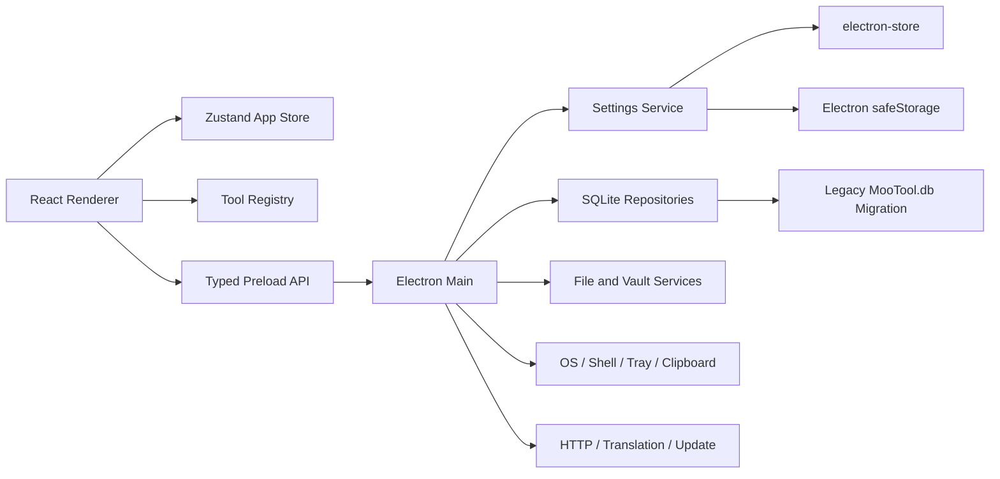

# MooTool Next：Java 版完整对齐迁移计划

> 状态：规划基线  
> 更新日期：2026-07-15  
> 目标技术栈：TypeScript + React + Vite + Electron  
> 功能基线：当前 Java 版 MooTool 代码、README 功能树与实际可运行行为

## 1. 项目目标

MooTool Next 不再以“精选 MVP”作为当前阶段目标，而是以 Java 旧版的完整功能和主要交互布局为基线，完成 TypeScript、React、Electron 的全量重写。

本阶段必须同时满足以下目标：

1. **功能一致**：Java 版已经可用的功能、子功能、历史记录、收藏、导入导出、快捷键和设置项都需要在 Next 中提供。
2. **布局尽量一致**：保留旧版工具页的信息层级、主要分区、操作顺序、Tab、工具栏、历史区和弹窗流程。
3. **桌面体验现代化**：使用当前已经确认的 Electron 左侧栏、macOS 风格窗口、明暗主题和品牌视觉，不机械复制 Swing 控件外观。
4. **数据可迁移**：旧版用户数据、SQLite 历史、配置、Vault 和收藏应尽可能无损迁移或直接兼容。
5. **跨平台一致**：macOS、Windows、Linux 的核心功能一致；平台能力差异必须有清晰降级和提示。
6. **国际化完整**：至少保持简体中文、英文、日文三种语言，新增界面不得硬编码用户可见文案。

旧版代码或 README 中明确标记为 TODO 且实际尚不可用的能力，不计入首轮 parity；它们进入对齐完成后的增强列表。例如当前配置转换中的 JSON/YAML 双向转换 TODO。

## 2. 对齐原则

### 2.1 功能真源

功能判断按以下优先级执行：

1. Java 版当前实际可运行行为。
2. `README.md` 中的 MooTool feature map。
3. `FuncTabCatalog.java`、各 `*Form.java`、Listener、Dialog、Service、Util 和数据库脚本。
4. 旧版截图、菜单、快捷键和 i18n 文案。

若 README 与代码不一致，以实际可运行代码为准，并在 parity 矩阵中记录差异。

### 2.2 布局对齐

- 当前已确认的主窗口结构继续使用：左侧工具导航、主工作区、顶部透明拖拽区。
- 左侧导航需恢复 Java 版 24 个工具、6 个内置分组、搜索、最近使用和可配置显示方式。
- 每个功能页内部以 Java 版布局为起点：分区、工具栏顺序、Tab 顺序、输入输出关系和弹窗层级尽量一致。
- 允许用 React 控件替代 Swing 控件，但不得因“视觉现代化”删除操作、合并关键流程或隐藏高级能力。
- 对旧版明显拥挤的布局，可以做响应式重排；桌面宽屏下仍应保持旧版的操作心智模型。
- 每个工具都需要保存旧版与 Next 的对比截图，作为布局验收证据。

### 2.3 行为对齐

- 相同输入应得到相同或等价输出。
- 校验规则、默认值、错误状态、复制、清空、导入、导出和历史写入时机应保持一致。
- 快捷键按平台映射：macOS 使用 `Command`，Windows/Linux 使用 `Ctrl`。
- 涉及系统权限的能力必须在主进程执行，并给出与旧版等价的失败提示。

## 3. 当前状态

### 3.1 已完成

- Electron + Vite + React + TypeScript 工程骨架。
- 隐藏式标题栏和全窗口顶部拖拽热区。
- 左侧导航与主工作区基础布局。
- 简体中文、英文、日文 i18n 基础设施。
- 明暗主题跟随系统。
- MooTool 正式 AppIcon、favicon 和页面品牌图标。
- Tooltip、Toast 通用反馈基础设施。
- JSON 格式化、压缩、换行、复制、清空、转义、还原和基础校验原型。

### 3.2 尚未完成

- 导航元数据仍写在 `Workbench.tsx`，没有统一工具注册中心。
- 搜索按钮、最近使用、设置按钮尚未形成真实业务闭环。
- 首页快捷入口与导航列表未由同一数据源生成。
- 24 个旧版工具中只有 JSON 有真实页面，且 JSON 仍未达到旧版完整能力。
- `electron-store` 尚未形成正式设置存储协议。
- 历史、收藏、SQLite、Vault、旧版数据迁移尚未设计落地。
- 系统托盘、更新、窗口关闭策略、快捷键和菜单尚未迁移。
- 缺少单元测试、Electron E2E 和视觉回归基线。

## 4. 目标架构



### 4.1 Renderer

建议目录：

```text
src/
├── app/
│   ├── App.tsx
│   ├── toolRegistry.ts
│   ├── appStore.ts
│   └── shortcuts.ts
├── features/
│   ├── settings/
│   ├── search/
│   ├── history/
│   ├── json/
│   └── <tool-id>/
└── shared/
    ├── components/
    ├── editor/
    ├── feedback/
    ├── i18n/
    ├── layout/
    └── theme/
```

### 4.2 工具注册中心

`toolRegistry` 是导航、搜索、首页快捷入口、最近记录、快捷键和页面渲染的唯一数据源。

每个工具至少包含：

```ts
type ToolDefinition = {
  id: ToolId
  groupId: ToolGroupId
  titleKey: MessageKey
  keywords: Record<Language, string[]>
  icon: LucideIcon
  component: LazyExoticComponent<ComponentType>
  status: 'placeholder' | 'in-progress' | 'parity-review' | 'complete'
  supportsHistory: boolean
  supportsFavorites: boolean
  settingsSection?: string
}
```

工具页面通过注册表加载，不再在 `Workbench` 中增加 `activeTool === ...` 条件分支。

### 4.3 状态边界

- React 本地状态：输入框、临时选中项、尚未保存的表单。
- Zustand：当前工具、搜索状态、最近访问、窗口级 UI 状态。
- `electron-store`：用户设置、最近工具、窗口尺寸、布局偏好和轻量状态。
- SQLite：历史、收藏、HTTP 请求、翻译记录、单词本等结构化业务数据。
- 文件系统：Quick Note Vault、JSON Vault、导入导出文件、图片、PDF 和备份。
- `safeStorage`：代理密码、Git Token 等敏感数据；不得以明文放进 renderer 或普通配置文件。

### 4.4 IPC 约束

- Renderer 不直接访问 Node.js、文件系统、数据库和系统命令。
- Preload 只暴露明确的类型安全 API，不暴露通用 `invoke(channel, payload)`。
- IPC 按域划分：`settings`、`history`、`files`、`vault`、`network`、`system`、`update`、`window`。
- 所有入参在主进程校验；路径、命令、URL 和文件扩展名必须做边界检查。
- 长耗时任务支持进度、取消和错误码，不依赖无法取消的单次 Promise。

## 5. 设置中心设计

设置不是迁移末尾的附属页面，而是所有工具和平台能力的基础依赖，应在第一阶段建立完整模型。

### 5.1 展示方式

- 保持 Java 版“设置对话框”的交互心智，使用单实例、模态的 Electron 子窗口。
- 设置窗口内部采用左侧分类或锚点导航 + 右侧滚动表单；分类顺序尽量对应旧版设置分区。
- 主窗口底部设置按钮、应用菜单和快捷键打开同一个设置窗口。
- 设置窗口复用同一套 i18n、主题、控件和 Toast，但拥有独立窗口尺寸与拖拽区。

### 5.2 设置分类

| 分类 | 必须对齐的设置 | 应用方式 |
| --- | --- | --- |
| 常规 | 语言、启动时检查更新、默认最大化、关闭窗口行为、系统托盘 | 部分即时，部分重启 |
| 外观 | 跟随系统主题、主题、强调色、跟随系统强调色、全局字体、全局字号、统一背景 | 尽量即时预览 |
| 布局与习惯 | 菜单/工具栏位置、功能导航位置、显示最近使用、紧凑、隐藏标题、分割线、经典/卡片/分组导航 | 即时应用 |
| 编辑器 | SQL 方言、Quick Note 字体字号、JSON 字体字号、软换行等 | 即时应用 |
| 网络 | HTTP 代理开关、Host、端口、用户名、密码 | 显式保存并测试 |
| 数据与备份 | 数据目录、导入导出、SQLite 迁移、Git 同步、自动同步 | 危险操作需确认 |
| Vault | Quick Note Vault、JSON Vault、远程仓库、自动提交、自动拉取、忽略文件、展开方式 | 显式保存 |
| 工具默认值 | QR 尺寸/纠错级别/Logo、随机字符串长度、导出目录、OCR 路径等 | 即时或显式保存 |
| 快捷键 | 全局工具搜索、设置、页面操作、工具特定快捷键 | 冲突检测后保存 |
| 关于与更新 | 版本、更新检查、项目链接、许可证 | 即时操作 |

### 5.3 设置 Schema

设置必须使用带版本号的统一 Schema，例如：

```ts
type AppSettings = {
  schemaVersion: number
  general: GeneralSettings
  appearance: AppearanceSettings
  layout: LayoutSettings
  editor: EditorSettings
  network: NetworkSettings
  data: DataSettings
  shortcuts: ShortcutSettings
  tools: ToolSettings
}
```

要求：

- 每个字段有默认值、类型、合法范围和是否需要重启的元数据。
- 每次 Schema 变更提供迁移函数，不直接丢弃旧设置。
- Renderer 只持有脱敏设置；密码和 Token 通过单独 API 写入 `safeStorage`。
- 数据目录切换必须先备份、验证目标目录、事务性迁移，再提示重启。
- 设置 UI 明确区分：即时生效、点击保存、需要重启、危险操作。

### 5.4 旧版设置迁移

- 扫描旧版配置目录 `~/.MooTool` 和自定义数据目录。
- 将旧配置键映射到新 Schema，未知键保留在迁移报告中。
- 首次迁移前创建完整备份，不修改原 Java 版数据。
- 显示迁移预览：发现的数据库、Vault、配置、历史和导出目录。
- 迁移过程可取消、可重试、可查看日志。

## 6. 数据与兼容策略

### 6.1 数据分层

| 数据类型 | Next 存储 | 兼容要求 |
| --- | --- | --- |
| 用户偏好 | `electron-store` | 映射 Java 配置键 |
| 敏感凭证 | `safeStorage` | 迁移后不保留明文 |
| 通用工具历史 | SQLite | 兼容 `t_func_history` 语义 |
| HTTP 历史 | SQLite | 保留请求、参数、Header、Cookie、Body |
| 翻译历史/单词本 | SQLite | 保留语言、翻译器、备注和时间 |
| 收藏 | SQLite | 保留颜色、Regex、Cron 等收藏 |
| Quick Note/JSON Vault | 文件系统 + Git | 保持目录和 Git 仓库兼容 |
| 窗口/导航状态 | `electron-store` | 最近工具和窗口状态 |

### 6.2 SQLite 技术验证

在正式迁移历史功能前完成一个独立技术验证：

1. 比较 Electron 当前 Node 运行时的 `node:sqlite` 与 `better-sqlite3`。
2. 验证 macOS ARM64/x64、Windows x64、Linux x64 打包与 CI。
3. 直接读取 Java 版 `MooTool.db` 的只读副本。
4. 对现有 schema 和 upgrade SQL 建立迁移测试。
5. 确认事务、备份、并发访问和损坏恢复策略后记录 ADR。

在验证完成前，不允许多个功能各自选择存储方案。

## 7. 完整功能迁移矩阵

状态定义：`未开始`、`骨架`、`开发中`、`待对齐验收`、`已对齐`。

| 分组 | Java ID | 工具 | 主要布局基线 | 建议阶段 | 当前状态 |
| --- | --- | --- | --- | --- | --- |
| 首页 | `mootool` | 首页/关于 | 首页、品牌、版本与入口 | P1 | 骨架 |
| 文本 | `quickNote` | 随手记 | 文件树、编辑器、预览、操作栏、替换侧栏 | P6 | 未开始 |
| 文本 | `textDiff` | 文本对比 | 左右输入、同步滚动、Unified Tab、操作栏 | P3 | 骨架 |
| 文本 | `reformat` | 格式化 | 字符串/文件 Tab、输入输出与格式类型 | P4 | 未开始 |
| 开发 | `json` | JSON | Vault/列表、编辑器、工具栏、结果与弹窗 | P2 | 开发中 |
| 开发 | `java` | Java/Groovy | 编辑器、格式化、运行结果、历史 | P6 | 未开始 |
| 开发 | `ymlProperties` | 配置转换 | 转换 Tab、校验、历史 | P3 | 未开始 |
| 开发 | `protobuf` | Protobuf | JSON/二进制、Wire、Hex/Base64 三个 Tab | P4 | 未开始 |
| 开发 | `variables` | 环境变量 | 系统变量/Java Properties Tab、表格、导出 | P5 | 未开始 |
| 网络 | `http` | HTTP 请求 | 请求列表、请求编辑、响应 Body/Header/Cookie、历史 | P5 | 骨架 |
| 网络 | `host` | Host | Host 列表、编辑器、查找替换、导入导出 | P5 | 未开始 |
| 网络 | `net` | 网络/IP | 功能选择、参数区、结果区 | P5 | 未开始 |
| 网络 | `uaParse` | UA 分析 | 输入、解析结果、预设、历史 | P3 | 未开始 |
| 编码 | `encode` | 编码解码 | 多转换 Tab、上下输入输出、历史 | P3 | 骨架 |
| 编码 | `crypto` | 加解密/随机 | 对称/非对称/摘要/Base64/随机 Tab | P4 | 未开始 |
| 编码 | `regex` | 正则 | 匹配测试/常用正则 Tab、收藏、历史 | P3 | 骨架 |
| 编码 | `cron` | Cron | 秒到年构建器、解析结果、运行时间、收藏 | P3 | 骨架 |
| 编码 | `qrCode` | 二维码 | 生成/识别/历史 Tab、预览与参数 | P4 | 骨架 |
| 日常 | `timeConvert` | 时间转换 | 双向转换、时区、快捷时间、历史、全屏钟 | P3 | 骨架 |
| 日常 | `translation` | 翻译 | 翻译/单词本/历史 Tab、语言与翻译器 | P5 | 未开始 |
| 日常 | `calculator` | 计算器 | 表达式、进制/GCD/LCM/排列组合、历史 | P3 | 未开始 |
| 日常 | `colorBoard` | 调色板 | 主题色、取色、转换、运算、收藏、历史 | P4 | 骨架 |
| 日常 | `image` | 图片助手 | 图像画布、缩放栏、导入导出、处理弹窗 | P4 | 骨架 |
| 日常 | `pdf` | PDF | 拆分/合并 Tab、文件队列和输出设置 | P4 | 未开始 |
| 系统 | `hardware` | 系统信息 | 系统/CPU/内存/存储/网络 Tab | P5 | 未开始 |

## 8. 分阶段实施计划

### P0：基线冻结与验收样本

- 冻结 Java 版功能基线，不删除旧代码。
- 为 24 个工具建立逐项 parity checklist。
- 保存每个工具的浅色/深色截图和关键弹窗截图。
- 为纯转换能力收集输入/输出 golden fixtures。
- 记录快捷键、默认值、错误提示和历史写入时机。
- 标记平台差异、外部依赖和旧版已知问题。

**出口条件**：每个工具都有可追踪的功能清单和布局参考。

### P1：导航内核、设置骨架与桌面基础

- 建立 24 工具、6 分组的 `toolRegistry`。
- 使用 Zustand 管理当前工具、搜索、最近访问和窗口 UI 状态。
- 实现工具搜索与 `Command/Ctrl + K`。
- 最近使用改为真实记录，数量与旧版 `RECENT_LIMIT = 5` 对齐。
- 恢复最后打开的工具。
- 建立设置 Schema、`electron-store` 服务和类型安全 IPC。
- 创建设置模态子窗口与全部设置分类骨架。
- 实现应用菜单、快捷键注册、窗口尺寸保存、关闭策略和系统托盘骨架。
- 清理现有按钮类型与编辑器可访问性警告。

**出口条件**：所有工具可通过注册表打开占位页；搜索、最近、设置、持久化形成闭环。

### P2：共享工作台能力与 JSON 完整对齐

- 抽取统一 Tool Page、Toolbar、Split Pane、Tabs、Editor、History、Favorite、File Picker。
- 完成 SQLite 技术验证和 Repository 层。
- 完成通用历史面板：搜索、应用、复制输入/输出、删除、清空。
- JSON 对齐：排序、忽略大小写、重复键、键值交换、JSON/XML、JavaBean、JSON Path、可视化选择器、导入导出、查找、字体字号。
- JSON Vault、Git 面板和相关设置达到旧版能力。

**出口条件**：JSON 通过完整功能、布局、数据和快捷键 parity 验收。

### P3：纯本地计算工具

- 时间转换。
- 编码解码。
- UA 分析。
- 计算器。
- Regex。
- Cron。
- 文本 Diff。
- Properties/YAML 配置转换。

这些工具优先复用通用输入输出、历史、收藏和 Tab 组件，并建立大量单元测试。

### P4：文件、媒体与密码学工具

- QR Code。
- Crypto/Random，包括 SM2/SM3/SM4。
- Color Board 与屏幕取色。
- Image Assistant，包括截图、压缩、水印、OCR。
- Reformat。
- PDF 拆分/合并。
- Protobuf。

该阶段需要重点验证剪贴板、文件拖放、原生对话框、长任务取消和平台权限。

### P5：网络与系统工具

- HTTP Request。
- Translation、单词本与翻译器 fallback。
- Host 管理与提权流程。
- Network/IP、WHOIS、ping、netstat、DNS flush。
- Environment。
- System Info。

该阶段同时完成代理设置、离线状态、超时、取消、权限和错误码设计。

### P6：复杂编辑器、Vault 与运行时

- Quick Note 全量能力、Markdown 预览、图片、搜索、导出、快速替换和 Git Vault。
- Java/Groovy 格式化与运行。
- 同步与备份闭环。
- 评估 Java/Groovy 运行时采用系统 JDK、可选运行时或受控子进程；Next 应用业务代码仍保持 TypeScript。

### P7：全量对齐、迁移与发布

- 逐工具执行 parity checklist。
- 执行旧版数据迁移和回滚演练。
- 完成 macOS、Windows、Linux 安装包与签名流程。
- 完成更新、托盘、关闭行为、设置和快捷键全量验收。
- 完成性能、内存、启动速度和大文件压力测试。
- 旧 Java 版继续保留，直到 Next 全量验收和迁移稳定后再决定维护策略。

## 9. 测试与验收

### 9.1 测试层级

- 单元测试：转换、解析、校验、排序、时间、Cron、Regex、Crypto 等纯逻辑。
- 组件测试：工具栏、Tabs、历史、收藏、设置表单、快捷键冲突。
- IPC 契约测试：权限、入参校验、错误码、取消和进度事件。
- 数据测试：旧 SQLite 样本、配置迁移、Vault、备份与回滚。
- Electron E2E：窗口、菜单、托盘、剪贴板、文件选择、设置子窗口。
- 视觉回归：Java 版参考图与 Next 对比，覆盖浅色、深色和三种语言。

### 9.2 基准视口

- 主要基准：`1440 x 920`。
- 最小窗口：`1080 x 720`。
- 额外检查：宽屏、系统缩放、中文/英文/日文最长文案。
- 页面不得出现工具栏溢出、文字截断、控件重叠或不可访问操作。

### 9.3 单工具 Definition of Done

一个工具只有同时满足以下条件才能标记为“已对齐”：

- Java 版可用功能 checklist 全部通过。
- 默认值、输入输出和错误行为对齐。
- 历史、收藏、导入导出和快捷键已对齐。
- 三种语言完成，无用户可见硬编码文案。
- 明暗主题与最小窗口布局通过。
- 与 Java 版主要布局对比已确认。
- 单元测试与关键 E2E 通过。
- 不绕过 preload 直接使用 Node API。
- 迁移后的旧版数据可以读取和继续使用。
- 文档中附有验收证据和已知差异。

## 10. 重点风险

| 风险 | 处理策略 |
| --- | --- |
| SQLite 原生模块与 Electron 打包 | P1/P2 先做跨平台技术验证和 ADR |
| Java/Groovy 运行 | 使用受控子进程，限制工作目录、参数和超时 |
| Host、DNS、系统命令权限 | 主进程白名单 API、平台实现、明确提权流程 |
| SM2/SM3/SM4 正确性 | 选择成熟库，使用标准测试向量验证 |
| OCR/Tesseract | 启动前探测、可配置路径、下载与离线策略 |
| 翻译服务变化 | Provider 抽象、超时、fallback、代理支持 |
| 大文件与长任务卡顿 | Worker/子进程、流式处理、进度和取消 |
| 旧数据迁移损坏 | 只读扫描、自动备份、事务迁移、可回滚 |
| 布局现代化导致功能遗漏 | 每个工具维护 Java/Next 双栏 parity checklist |
| 设置项扩散 | 所有设置先进入统一 Schema，再接 UI 和存储 |

## 11. 近期执行清单

下一里程碑固定为 **P1：导航内核、设置骨架与桌面基础**。

- [ ] 建立 24 工具和 6 分组的 TypeScript 注册表。
- [ ] 将左侧导航、首页入口和搜索改为注册表驱动。
- [ ] 建立 Zustand 工作台 Store。
- [ ] 实现真实工具搜索和 `Command/Ctrl + K`。
- [ ] 实现最近 5 个工具与最后打开工具持久化。
- [ ] 定义版本化 `AppSettings` Schema。
- [ ] 建立 `electron-store` 主进程服务和 typed preload API。
- [ ] 创建设置模态子窗口和全部分类骨架。
- [ ] 先接通语言、主题、强调色、字体字号、显示最近和布局设置。
- [ ] 预留代理、数据目录、Vault、快捷键、更新和托盘设置域。
- [ ] 建立 P0 parity checklist 模板并填写 JSON 样例。
- [ ] 补齐当前基础可访问性和按钮类型问题。
- [ ] 增加基础单元测试和 Electron E2E 入口。

完成这一里程碑后，再进入 JSON 的完整 parity，而不是继续增加彼此孤立的占位页面。
