# MooTool

A handy tool set for developers.   
开发者常备小工具

## 截图速览

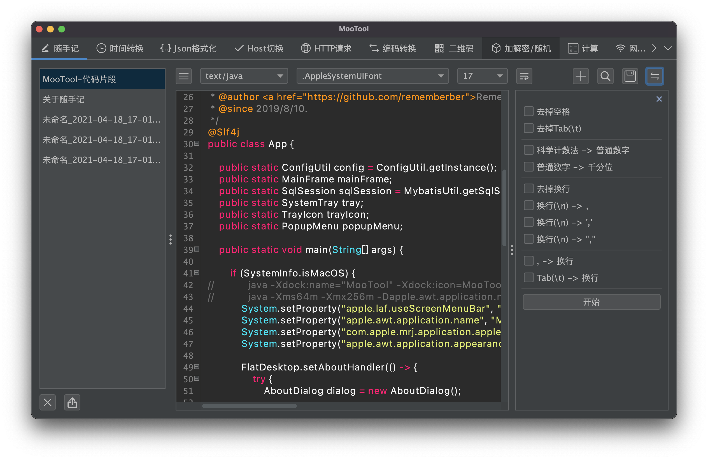

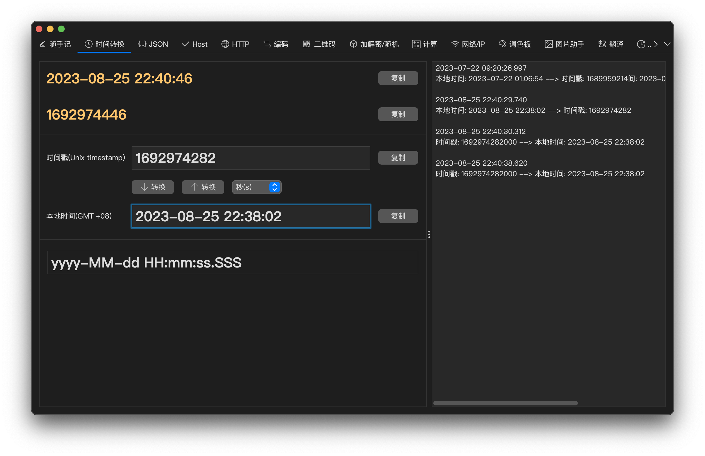

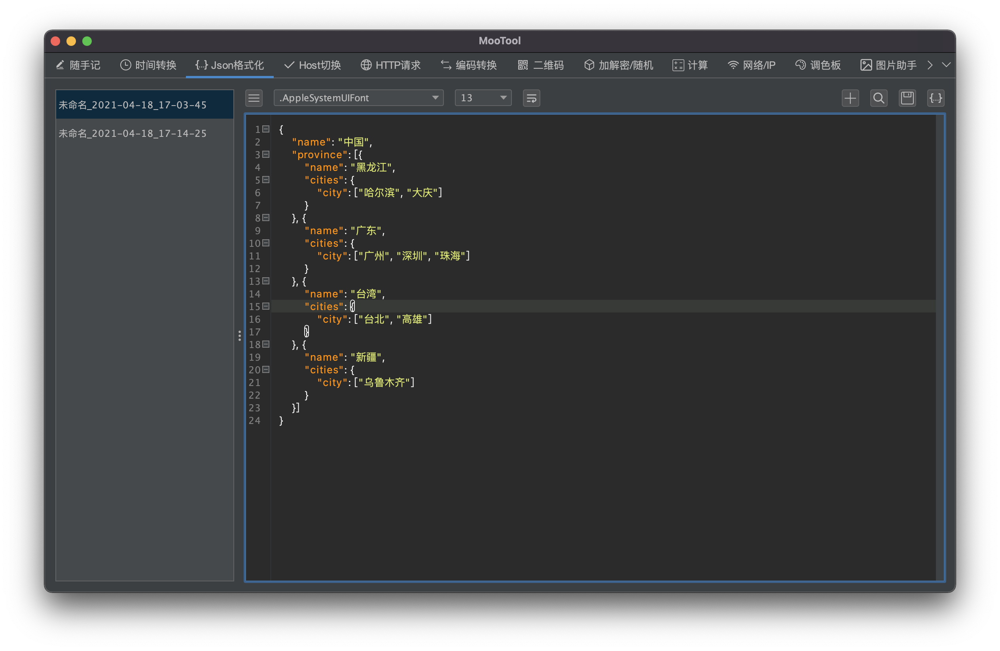

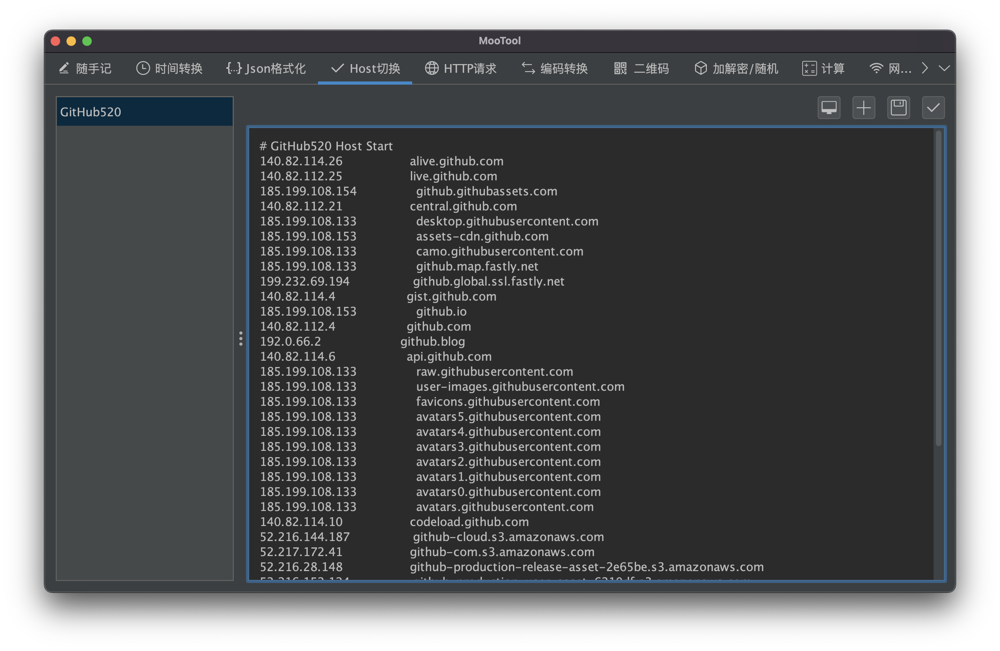

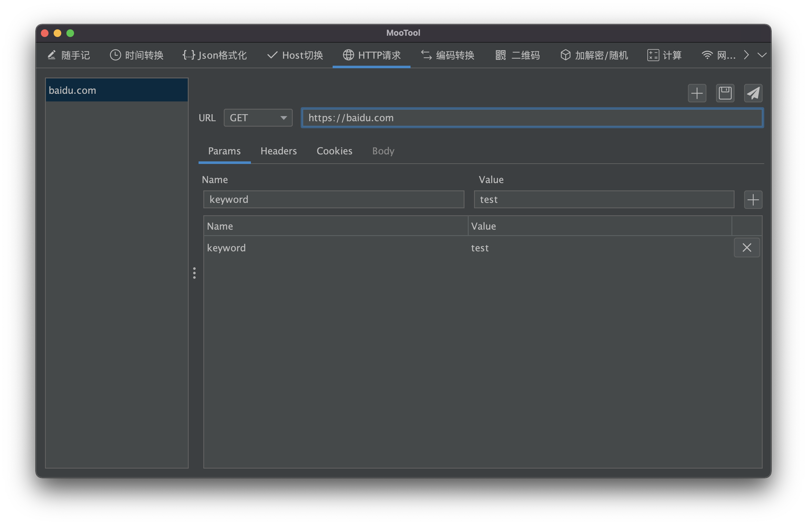

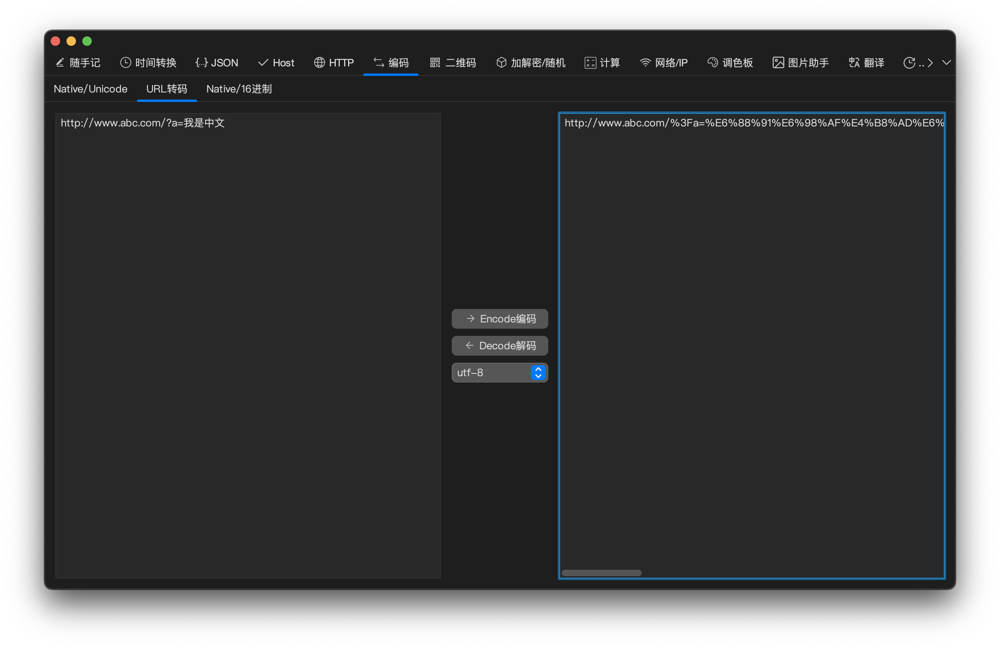

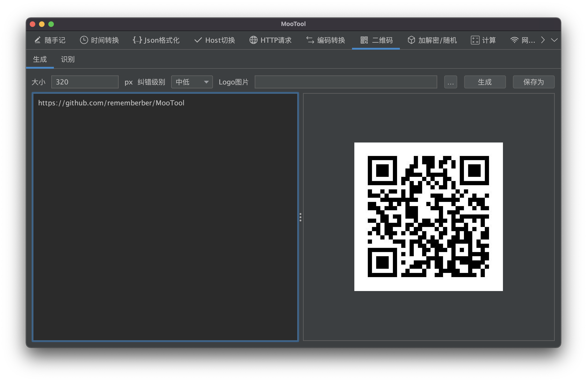

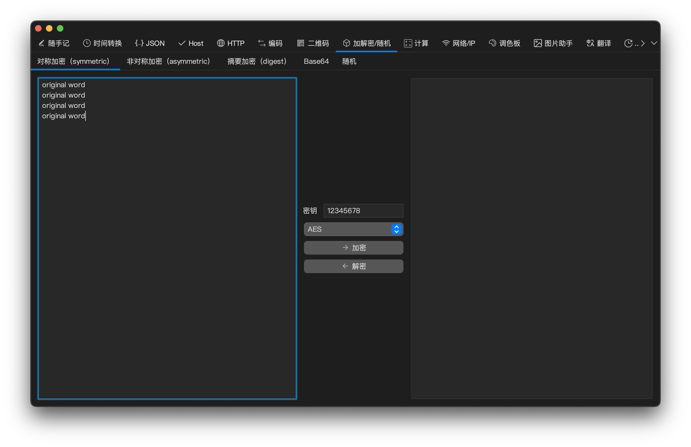

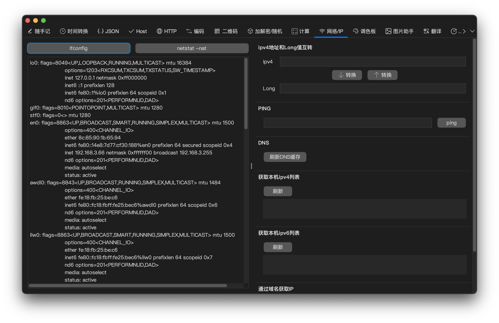

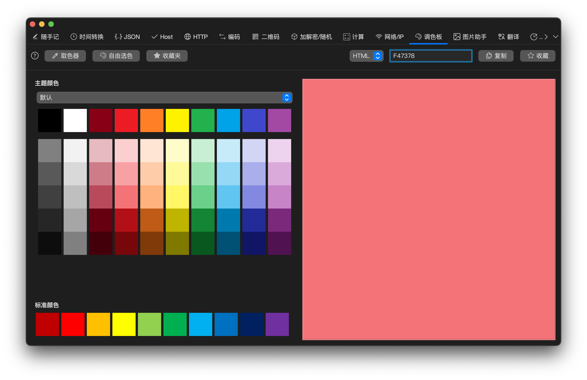

  

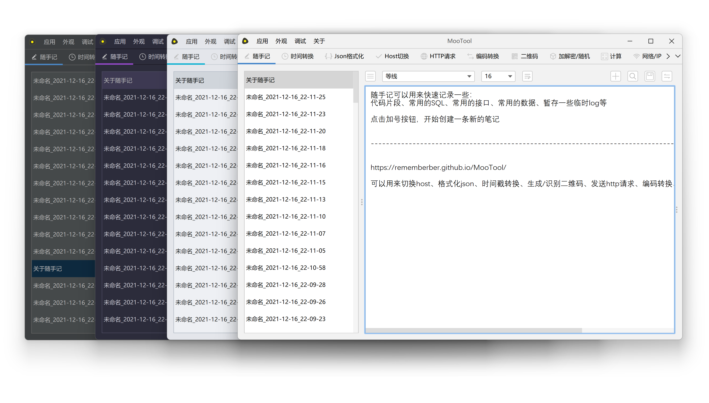

## 支持的功能

+ **Host切换**（支持系统托盘快速切换）
+ **时间转换**（时间戳和高可读性本地时间的相互转换，对网上常见的转换页重新设计，支持快速复制，简单高效）
+ **Json格式化**
+ **发送HTTP请求**（支持GET、POST、PUT、DELETE等常用请求方式，支持参数、header、cookie、body等）
+ **编码转换**
+ **二维码生成/二维码识别**（支持自定义尺寸、纠错级别、logo图片）
+ **加解密/随机**
+ **随手记**（可以用来快速记录一些：代码片段、常用的SQL、常用的接口、常用的数据、暂存一些临时log等）
+ **计算**（四则运算/进制转换/最大公约数/最小公倍数/排列组合数）
+ **网络/IP**（ip地址转换/本机ip信息/根据域名获取ip）
+ **调色板**（取色器/颜色管理）

## 计划中支持的功能

+ 正则表达式
+ Cron表达式
+ 图片压缩

## 下载

[https://github.com/rememberber/MooTool/releases](https://github.com/rememberber/MooTool/releases)  
[https://gitee.com/zhoubochina/MooTool/releases](https://gitee.com/zhoubochina/MooTool/releases)

## 特别感谢

[Hutool](http://hutool.cn/)  
[Darcula](https://github.com/bulenkov/Darcula)  
[BeautyEye](https://gitee.com/jackjiang/beautyeye)  
[vscode-icons](https://github.com/microsoft/vscode-icons)  
[iconfont](https://www.iconfont.cn/)

## 开发温馨提示

在你开始开发之前, **请按下图设置IntelliJ IDEA**, 然后 **maven clean**:
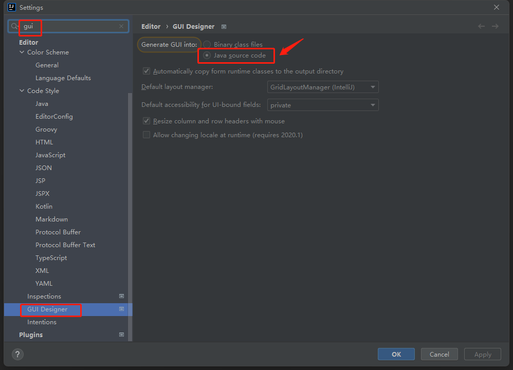

## 鼓励/赞赏

**如果MooTool项目对您有所帮助或带来便利，  
欢迎对我每天下班和周末时光的努力进行肯定，  
您的赞赏将会给我带来更多动力**

