# MooTool

Handy tool set for developers.   
开发者常备小工具

## 支持的平台
Windows • Linux • macOS

## 截图速览

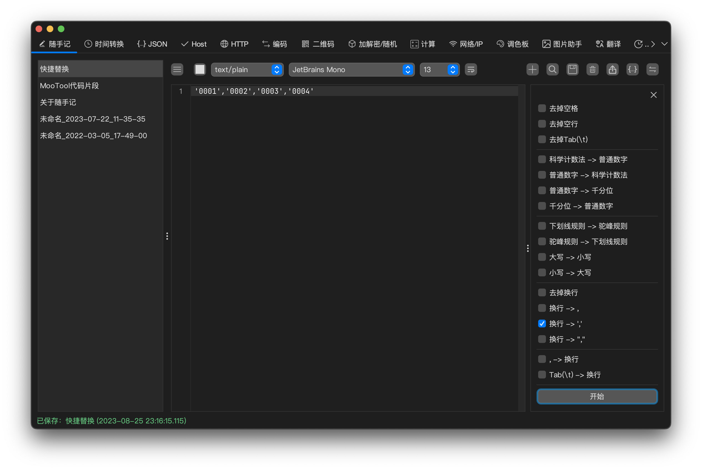

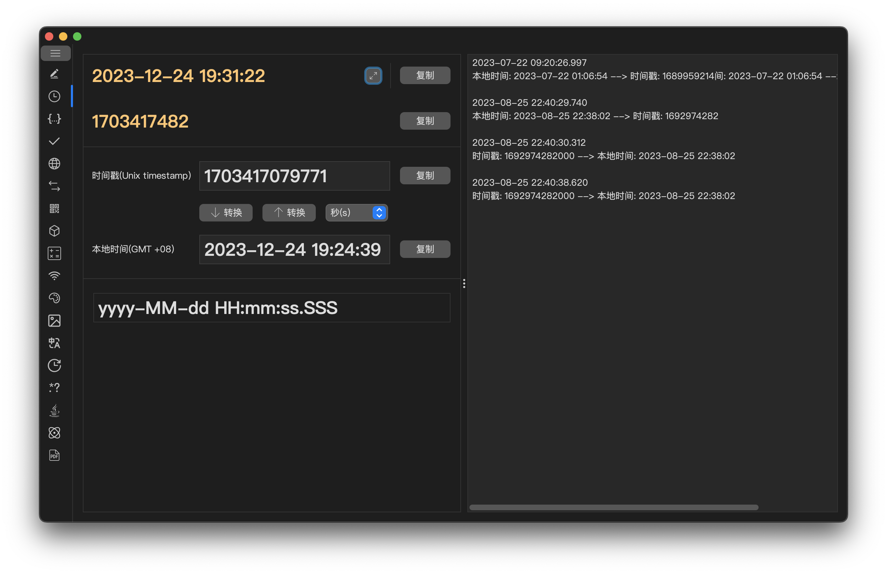

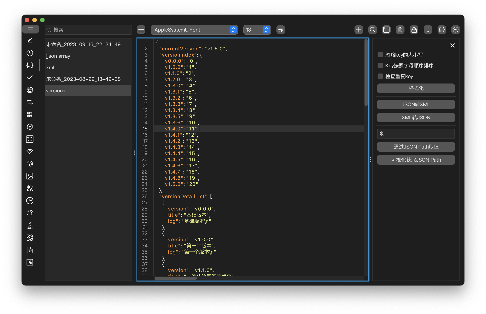

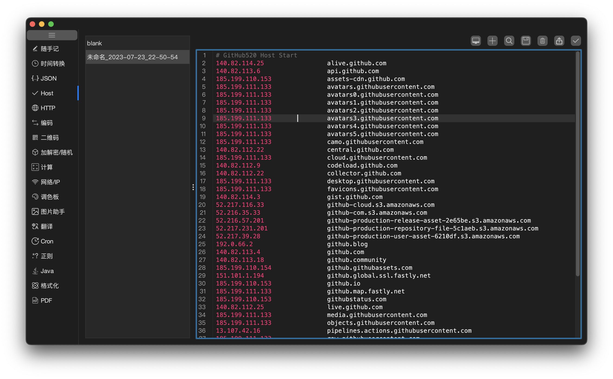

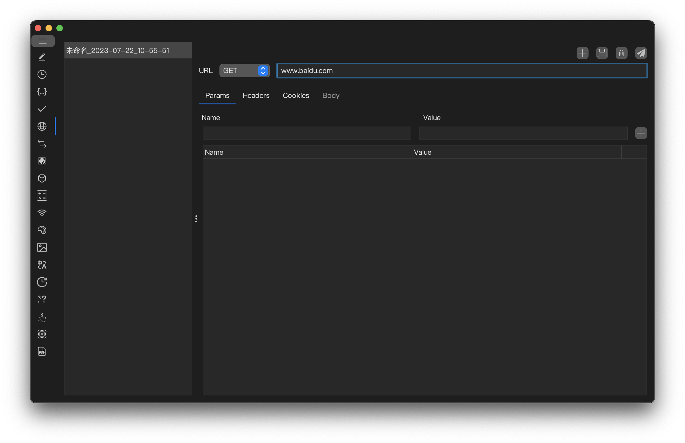

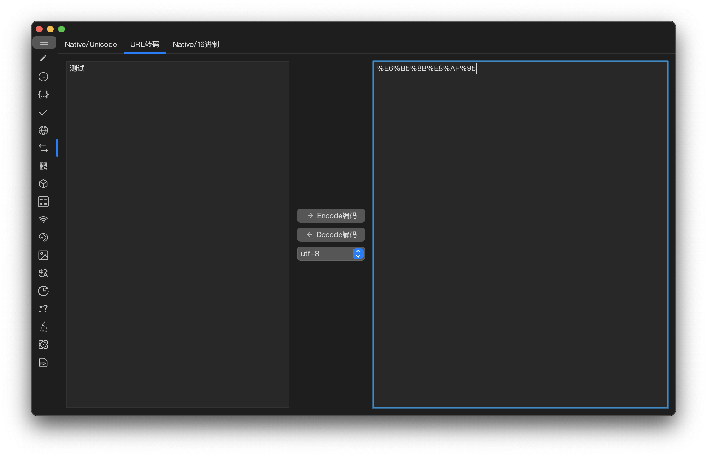

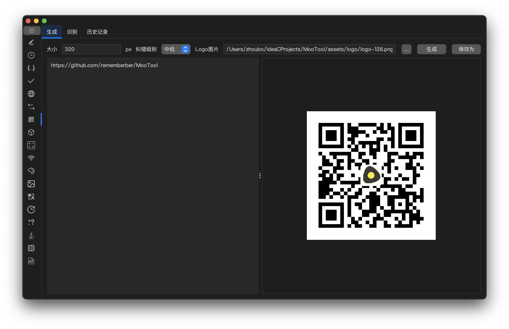

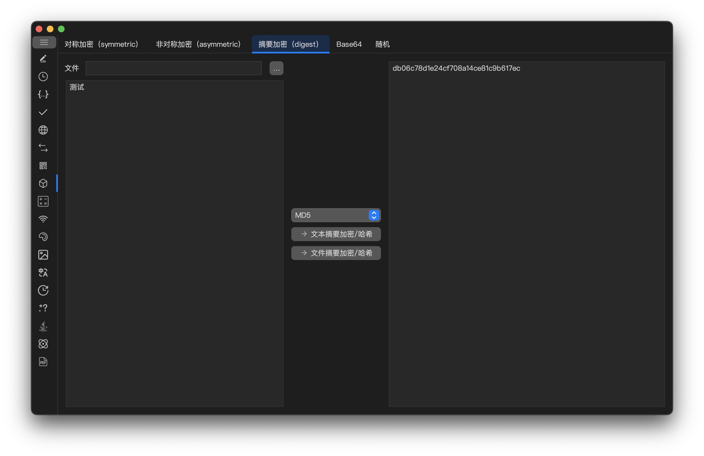

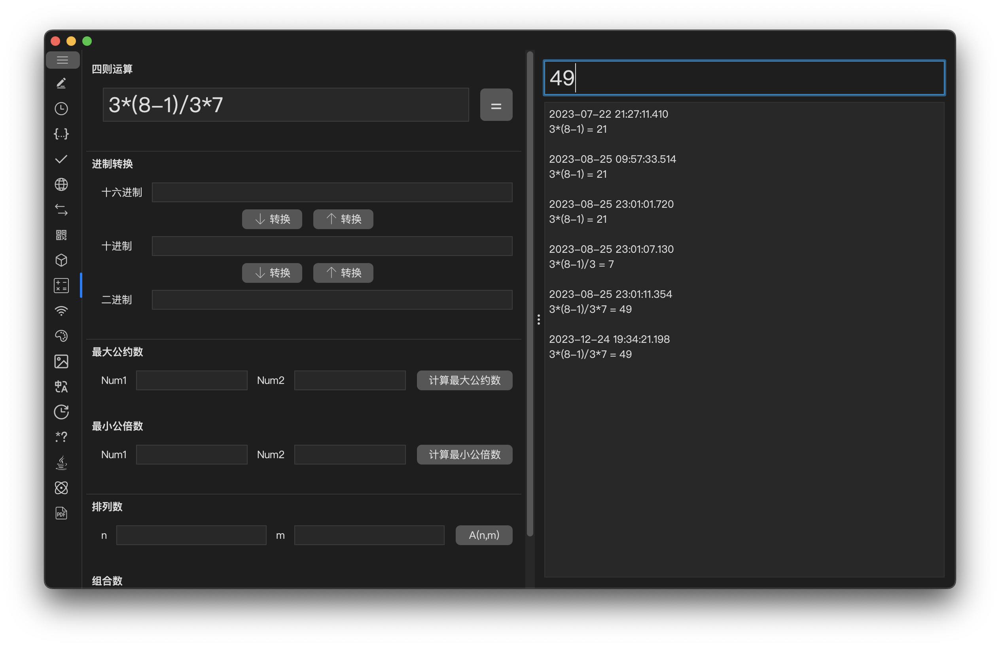

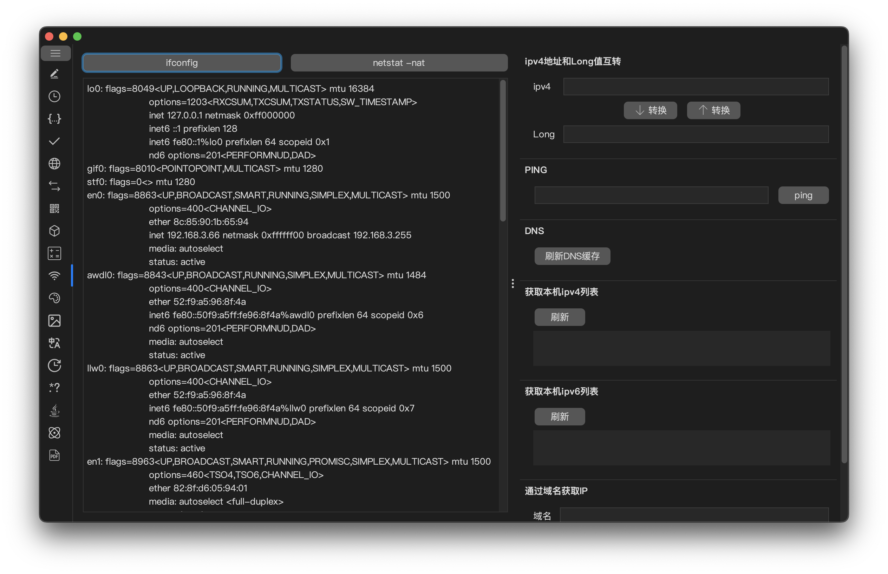

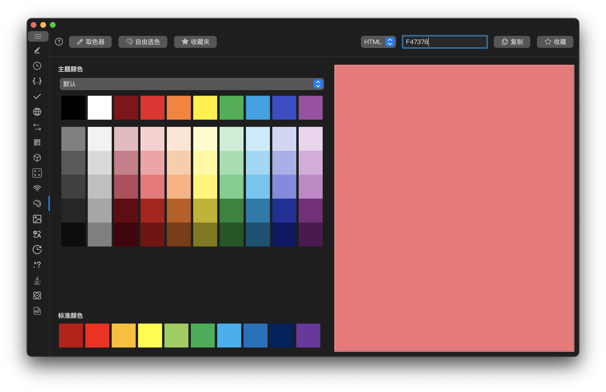

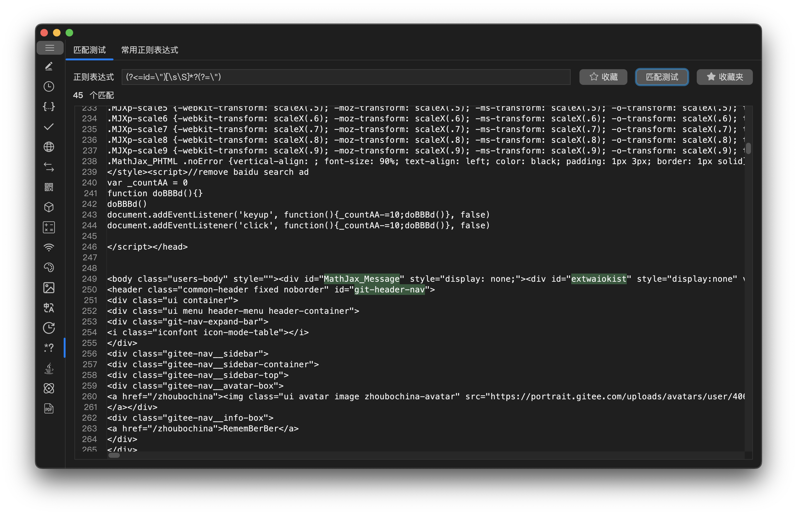

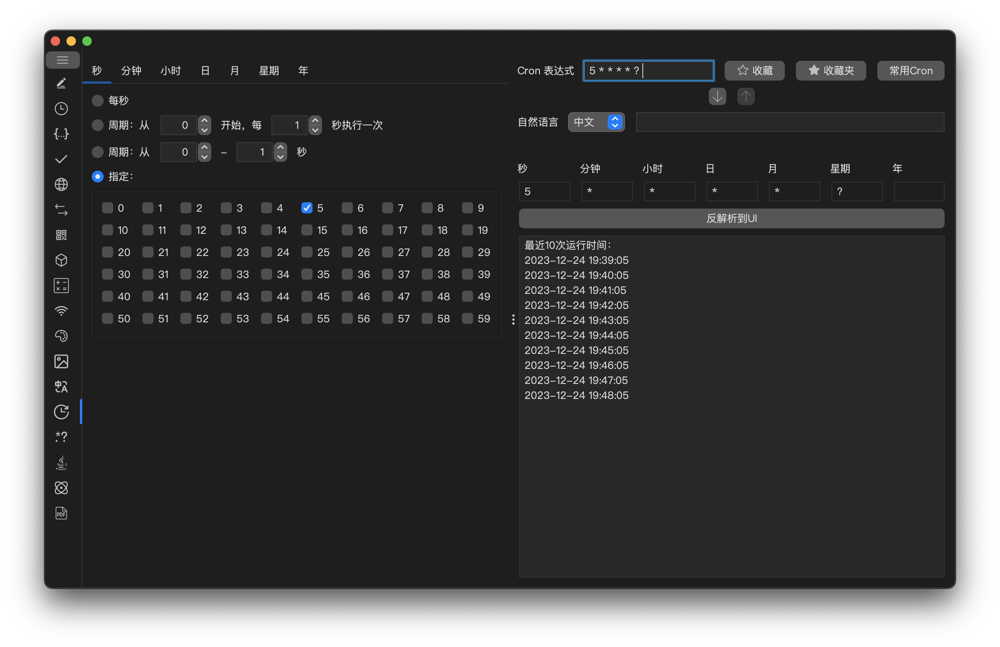

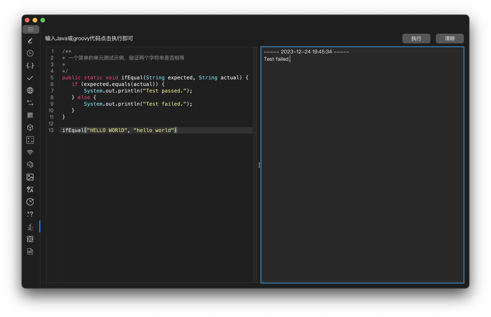

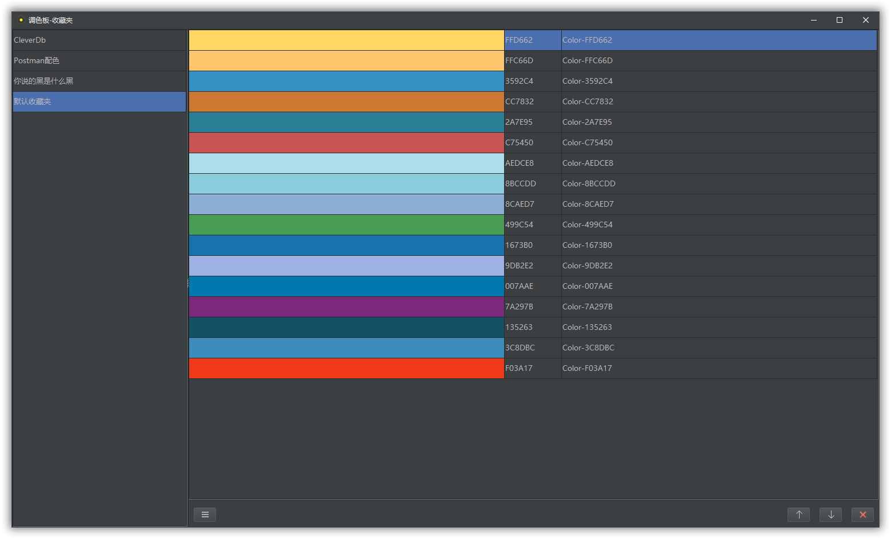

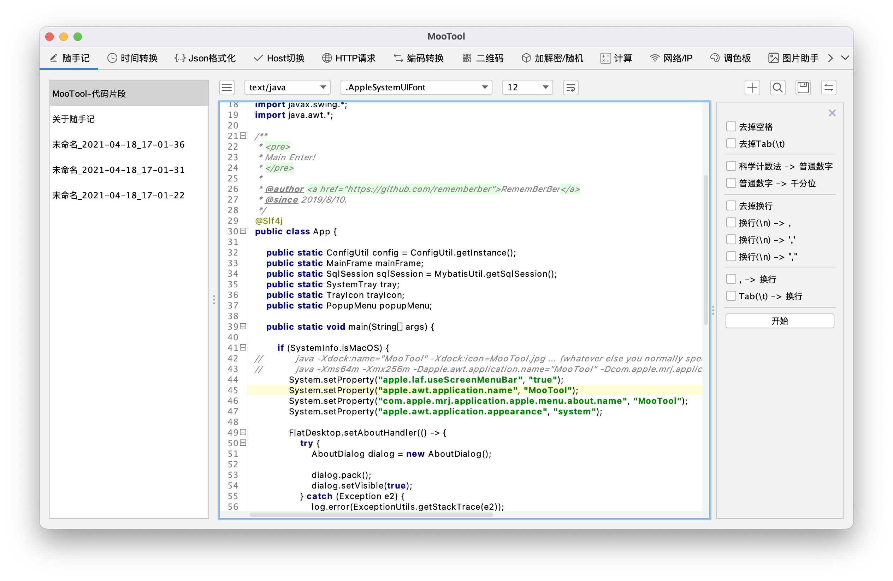

## 下载

[https://github.com/rememberber/MooTool/releases](https://github.com/rememberber/MooTool/releases)  
[https://gitee.com/zhoubochina/MooTool/releases](https://gitee.com/zhoubochina/MooTool/releases)

## 鼓励/赞赏

**如果MooTool项目对您有所帮助或带来便利，  
欢迎对我每天下班和周末时光的努力进行肯定，  
您的赞赏将会给我带来更多动力**

# MooTool全功能地图
## 随手记
### 多语言语法高亮支持
- markdown
- java
- c
- cpp
- cs
- python
- golang
- kotlin
- scala
- groovy
- ruby
- html
- sql
- json
- jshintrc
- xml
- yaml
- javascript
- jsp
- typescript
- css
- less
- php
- properties
- asm
- asm6502
- bbcode
- clojure
- csv
- d
- dockerfile
- dart
- delphi
- dtd
- fortran
- hosts
- htaccess
- ini
- latex
- lisp
- lua
- makefile
- mxml
- nsis
- perl
- sas
- tcl
- unix
- vb
- bat
### 常见语言代码格式化
- SQL
- JSON
- Java
### 有序/无序列表
### 导出/批量导出，全局查找
### 字体、字号、列表颜色
### 快捷操作
- 自动保存
- 去掉空格
- 去掉空行
- 去掉Tab(\t)
- 科学计数法->普通数字
- 普通数字->科学计数法
- 普通数字->千分位
- 千分位->普通数字
- 下划线命名->驼峰命名
- 驼峰命名->下划线命名
- 大写->小写
- 小写->大写
- 去掉换行
- 换行->,
- 换行->','
- 换行->","
- ,->换行
- ','->换行
- ","->换行
- Tab(\t)->换行
- 按行去重
- 按行去重并统计出现次数
- 转义
- 反转义
- 按行倒序
- 按行A->Z排序
- 按行Z->A排序
- 按拼音排序

## 时间转换
### 时间戳转换
- 时间->时间戳(毫秒)
- 时间戳(毫秒)->时间
- 时间戳->时间(秒)
- 时间->时间戳(秒)
### 历史记录
### 大屏时钟

## JSON
### JSON格式化
### JSON压缩
### 导出/批量导出，查找
### 字体、字号
### JSON Key Value互转
### JSON转XML
### XML转JSON
### JavaBean转JSON
### JSON转JavaBean
### 转义
### 反转义
### 通过JsonPath获取JSON数据
### 可视化获取JsonPath

## 翻译
### 中英互译
### 自动检测语言

## Host
### Host格式化/语法高亮
### 本机Host管理/查看
### Host导入/导出

## HTTP
### HTTP请求，支持GET/POST/PUT/DELETE/HEAD/PATCH/OPTIONS
### HTTP Header/Body格式化
### 请求管理
### 请求历史记录

## 编码转换
### Native->Unicode
### Unicode->Native
### URL编码/解码
### Native->十六进制
### 十六进制->Native

## 二维码
### 二维码生成
- 尺寸自定义
- 纠错等级自定义
- logo自定义
### 二维码解析
### 历史记录

## 加解密/随机
### 对称加密/解密
- AES
- DES
### 非对称加密/解密
- RSA
### 摘要算法（文件/文本摘要）
- MD5
- SHA1
- SHA256
- SHA384
- SHA512
### Base64编码/解码
### Base32编码/解码
### 随机UUID生成
### 随机生成只包含数字/字母/数字字母的字符串，位数自定义
### 随机生成复杂密码，位数自定义

## 计算
### 四则运算
### 进制转换
### 最大公约数
### 最小公倍数
### 排列组合数
### 历史记录

## 网络
### IP查询
### 域名查询
### netstat
### ping
### ipv4-Long互相转换
### 刷新DNS

## 调色板
### 主题颜色/标准颜色
### 屏幕取色器
### 自由选色
### 颜色格式转换
### 颜色收藏
### 颜色混合计算（TODO）

## 图片助手
### 本地图床
### 图片Base64编码/解码
### 图片压缩（TODO）
### 图片加水印（TODO）
### 图片OCR识别（TODO）

## Cron
### Cron表达式生成
### Cron表达式解析
### Cron表达式校验
### Cron表达式收藏
### Cron表达式历史记录（TODO）
### 常用Cron表达式

## 正则
### 正则表达式匹配测试
### 收藏正则表达式
### 常用正则表达式

## Java
### Java/groovy代码格式化、高亮
### Java/groovy代码解释执行

## 格式化
### Nginx配置文件格式化
### XML格式化
### HTML格式化
### Java格式化

## PDF
### PDF拆分
### PDF合并

## 环境变量
### 系统环境变量
### Java环境变量

## 配置文件转换
### Properties->YAML
### YAML->Properties
### JSON->YAML（TODO）
### YAML->JSON（TODO）

## 特别感谢

[Hutool](http://hutool.cn/)  
[FlatLaf](https://github.com/JFormDesigner/FlatLaf)  
[vscode-icons](https://github.com/microsoft/vscode-icons)  
[iconfont](https://www.iconfont.cn/)

## 开发温馨提示
最低JDK版本要求：**17**  
在你开始开发之前, **请按下图设置IntelliJ IDEA**, 然后 **maven clean**:
